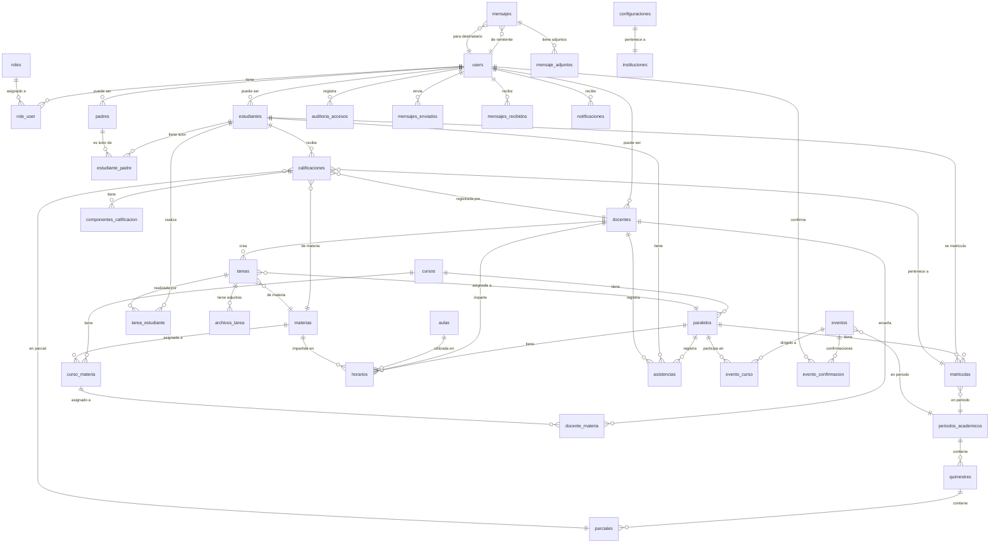

# Diagrama de Base de Datos

## Sistema de Gestión Académica y Comunicación Escolar
**Unidad Educativa Oswaldo Guayasamín - Galápagos**

---

## 📋 Índice

1. [Diagrama Entidad-Relación](#diagrama-entidad-relación)
2. [Descripción de Tablas](#descripción-de-tablas)
3. [Relaciones entre Tablas](#relaciones-entre-tablas)
4. [Índices y Optimizaciones](#índices-y-optimizaciones)
5. [Consideraciones de Diseño](#consideraciones-de-diseño)

---

## Diagrama Entidad-Relación



---

## Descripción de Tablas

### 👤 **Gestión de Usuarios y Roles**

#### `users`
Tabla principal de usuarios del sistema.

| Campo | Tipo | Descripción | Constraints |
|-------|------|-------------|-------------|
| id | BIGINT | ID único del usuario | PK, AUTO_INCREMENT |
| name | VARCHAR(255) | Nombre completo | NOT NULL |
| email | VARCHAR(255) | Correo electrónico | UNIQUE, NOT NULL |
| email_verified_at | TIMESTAMP | Fecha verificación email | NULL |
| password | VARCHAR(255) | Contraseña encriptada | NOT NULL |
| cedula | VARCHAR(10) | Cédula de identidad | UNIQUE, NULL |
| telefono | VARCHAR(20) | Teléfono de contacto | NULL |
| direccion | TEXT | Dirección domiciliaria | NULL |
| foto_perfil | VARCHAR(255) | URL foto de perfil | NULL |
| fecha_nacimiento | DATE | Fecha de nacimiento | NULL |
| estado | ENUM | activo/inactivo/bloqueado | DEFAULT 'activo' |
| ultimo_acceso | TIMESTAMP | Último inicio de sesión | NULL |
| intentos_fallidos | INT | Intentos fallidos login | DEFAULT 0 |
| remember_token | VARCHAR(100) | Token recordar sesión | NULL |
| created_at | TIMESTAMP | Fecha de creación | NULL |
| updated_at | TIMESTAMP | Fecha de actualización | NULL |

#### `roles`
Catálogo de roles del sistema.

| Campo | Tipo | Descripción | Constraints |
|-------|------|-------------|-------------|
| id | BIGINT | ID único del rol | PK, AUTO_INCREMENT |
| nombre | VARCHAR(50) | Nombre del rol | UNIQUE, NOT NULL |
| slug | VARCHAR(50) | Slug del rol | UNIQUE, NOT NULL |
| descripcion | TEXT | Descripción del rol | NULL |
| permisos | JSON | Permisos del rol | NULL |
| created_at | TIMESTAMP | Fecha de creación | NULL |
| updated_at | TIMESTAMP | Fecha de actualización | NULL |

**Roles predefinidos**: `administrador`, `docente`, `padre`, `estudiante`, `admin_tecnico`

#### `role_user`
Tabla pivote para relación muchos a muchos entre usuarios y roles.

| Campo | Tipo | Descripción | Constraints |
|-------|------|-------------|-------------|
| id | BIGINT | ID único | PK, AUTO_INCREMENT |
| user_id | BIGINT | ID del usuario | FK users.id |
| role_id | BIGINT | ID del rol | FK roles.id |
| created_at | TIMESTAMP | Fecha de asignación | NULL |
| updated_at | TIMESTAMP | Fecha de actualización | NULL |

**UNIQUE**: (user_id, role_id)

---

### 🏫 **Estructura Académica**

#### `instituciones`
Información de la institución educativa.

| Campo | Tipo | Descripción | Constraints |
|-------|------|-------------|-------------|
| id | BIGINT | ID único | PK, AUTO_INCREMENT |
| nombre | VARCHAR(255) | Nombre institución | NOT NULL |
| codigo_amie | VARCHAR(20) | Código AMIE (Ecuador) | UNIQUE |
| logo | VARCHAR(255) | URL del logo | NULL |
| direccion | TEXT | Dirección | NULL |
| telefono | VARCHAR(20) | Teléfono | NULL |
| email | VARCHAR(255) | Email institucional | NULL |
| sitio_web | VARCHAR(255) | Sitio web | NULL |
| created_at | TIMESTAMP | Fecha de creación | NULL |
| updated_at | TIMESTAMP | Fecha de actualización | NULL |

#### `periodos_academicos`
Años lectivos.

| Campo | Tipo | Descripción | Constraints |
|-------|------|-------------|-------------|
| id | BIGINT | ID único | PK, AUTO_INCREMENT |
| nombre | VARCHAR(100) | Ej: "2024-2025" | NOT NULL |
| fecha_inicio | DATE | Inicio del período | NOT NULL |
| fecha_fin | DATE | Fin del período | NOT NULL |
| estado | ENUM | planificado/activo/finalizado | DEFAULT 'planificado' |
| created_at | TIMESTAMP | Fecha de creación | NULL |
| updated_at | TIMESTAMP | Fecha de actualización | NULL |

#### `quimestres`
Quimestres del año lectivo.

| Campo | Tipo | Descripción | Constraints |
|-------|------|-------------|-------------|
| id | BIGINT | ID único | PK, AUTO_INCREMENT |
| periodo_academico_id | BIGINT | ID del período | FK periodos_academicos.id |
| nombre | VARCHAR(50) | "Primer Quimestre" | NOT NULL |
| numero | INT | 1 o 2 | NOT NULL |
| fecha_inicio | DATE | Inicio del quimestre | NOT NULL |
| fecha_fin | DATE | Fin del quimestre | NOT NULL |
| created_at | TIMESTAMP | Fecha de creación | NULL |
| updated_at | TIMESTAMP | Fecha de actualización | NULL |

#### `parciales`
Parciales del quimestre.

| Campo | Tipo | Descripción | Constraints |
|-------|------|-------------|-------------|
| id | BIGINT | ID único | PK, AUTO_INCREMENT |
| quimestre_id | BIGINT | ID del quimestre | FK quimestres.id |
| nombre | VARCHAR(50) | "Primer Parcial" | NOT NULL |
| numero | INT | 1, 2 o 3 | NOT NULL |
| fecha_inicio | DATE | Inicio del parcial | NOT NULL |
| fecha_fin | DATE | Fin del parcial | NOT NULL |
| permite_edicion | BOOLEAN | Permite editar notas | DEFAULT true |
| created_at | TIMESTAMP | Fecha de creación | NULL |
| updated_at | TIMESTAMP | Fecha de actualización | NULL |

#### `cursos`
Cursos o grados (1ro básica, 2do básica, etc.).

| Campo | Tipo | Descripción | Constraints |
|-------|------|-------------|-------------|
| id | BIGINT | ID único | PK, AUTO_INCREMENT |
| nombre | VARCHAR(100) | "1ro Básica" | NOT NULL |
| nivel | VARCHAR(50) | Inicial/Básica/Bachillerato | NOT NULL |
| orden | INT | Orden para listar | NOT NULL |
| descripcion | TEXT | Descripción del curso | NULL |
| estado | ENUM | activo/inactivo | DEFAULT 'activo' |
| created_at | TIMESTAMP | Fecha de creación | NULL |
| updated_at | TIMESTAMP | Fecha de actualización | NULL |

#### `paralelos`
Paralelos de cada curso (A, B, C).

| Campo | Tipo | Descripción | Constraints |
|-------|------|-------------|-------------|
| id | BIGINT | ID único | PK, AUTO_INCREMENT |
| curso_id | BIGINT | ID del curso | FK cursos.id |
| nombre | VARCHAR(10) | "A", "B", "C" | NOT NULL |
| cupo_maximo | INT | Cupo máximo estudiantes | NULL |
| aula_id | BIGINT | Aula asignada | FK aulas.id, NULL |
| created_at | TIMESTAMP | Fecha de creación | NULL |
| updated_at | TIMESTAMP | Fecha de actualización | NULL |

**UNIQUE**: (curso_id, nombre)

#### `materias`
Catálogo de materias.

| Campo | Tipo | Descripción | Constraints |
|-------|------|-------------|-------------|
| id | BIGINT | ID único | PK, AUTO_INCREMENT |
| nombre | VARCHAR(100) | "Matemáticas" | NOT NULL |
| codigo | VARCHAR(20) | Código de materia | UNIQUE |
| area | VARCHAR(50) | Área del conocimiento | NULL |
| descripcion | TEXT | Descripción | NULL |
| color | VARCHAR(7) | Color hex para UI | NULL |
| estado | ENUM | activa/inactiva | DEFAULT 'activa' |
| created_at | TIMESTAMP | Fecha de creación | NULL |
| updated_at | TIMESTAMP | Fecha de actualización | NULL |

#### `curso_materia`
Relación materias asignadas a cursos.

| Campo | Tipo | Descripción | Constraints |
|-------|------|-------------|-------------|
| id | BIGINT | ID único | PK, AUTO_INCREMENT |
| curso_id | BIGINT | ID del curso | FK cursos.id |
| materia_id | BIGINT | ID de la materia | FK materias.id |
| periodo_academico_id | BIGINT | ID del período | FK periodos_academicos.id |
| horas_semanales | INT | Horas de clase/semana | NULL |
| created_at | TIMESTAMP | Fecha de creación | NULL |
| updated_at | TIMESTAMP | Fecha de actualización | NULL |

**UNIQUE**: (curso_id, materia_id, periodo_academico_id)

#### `aulas`
Salones o aulas de clase.

| Campo | Tipo | Descripción | Constraints |
|-------|------|-------------|-------------|
| id | BIGINT | ID único | PK, AUTO_INCREMENT |
| nombre | VARCHAR(50) | "Aula 101" | NOT NULL |
| capacidad | INT | Capacidad de estudiantes | NULL |
| edificio | VARCHAR(50) | Nombre del edificio | NULL |
| piso | INT | Número de piso | NULL |
| estado | ENUM | disponible/ocupada/mantenimiento | DEFAULT 'disponible' |
| created_at | TIMESTAMP | Fecha de creación | NULL |
| updated_at | TIMESTAMP | Fecha de actualización | NULL |

---

### 👨‍🏫 **Docentes**

#### `docentes`
Información específica de docentes.

| Campo | Tipo | Descripción | Constraints |
|-------|------|-------------|-------------|
| id | BIGINT | ID único | PK, AUTO_INCREMENT |
| user_id | BIGINT | ID del usuario | FK users.id, UNIQUE |
| codigo_docente | VARCHAR(20) | Código institucional | UNIQUE |
| titulo_profesional | VARCHAR(255) | Título profesional | NULL |
| especialidad | VARCHAR(100) | Especialidad | NULL |
| fecha_ingreso | DATE | Fecha ingreso institución | NULL |
| tipo_contrato | ENUM | nombramiento/contrato | NULL |
| estado | ENUM | activo/inactivo/licencia | DEFAULT 'activo' |
| created_at | TIMESTAMP | Fecha de creación | NULL |
| updated_at | TIMESTAMP | Fecha de actualización | NULL |

#### `docente_materia`
Asignación de docentes a materias por paralelo.

| Campo | Tipo | Descripción | Constraints |
|-------|------|-------------|-------------|
| id | BIGINT | ID único | PK, AUTO_INCREMENT |
| docente_id | BIGINT | ID del docente | FK docentes.id |
| curso_materia_id | BIGINT | ID curso-materia | FK curso_materia.id |
| paralelo_id | BIGINT | ID del paralelo | FK paralelos.id |
| periodo_academico_id | BIGINT | ID del período | FK periodos_academicos.id |
| es_titular | BOOLEAN | Es profesor titular | DEFAULT false |
| created_at | TIMESTAMP | Fecha de creación | NULL |
| updated_at | TIMESTAMP | Fecha de actualización | NULL |

---

### 🎓 **Estudiantes**

#### `estudiantes`
Información específica de estudiantes.

| Campo | Tipo | Descripción | Constraints |
|-------|------|-------------|-------------|
| id | BIGINT | ID único | PK, AUTO_INCREMENT |
| user_id | BIGINT | ID del usuario | FK users.id, UNIQUE |
| codigo_estudiante | VARCHAR(20) | Código institucional | UNIQUE |
| fecha_ingreso | DATE | Fecha de ingreso | NULL |
| tipo_sangre | VARCHAR(5) | Tipo de sangre | NULL |
| alergias | TEXT | Alergias conocidas | NULL |
| contacto_emergencia | VARCHAR(255) | Contacto emergencia | NULL |
| telefono_emergencia | VARCHAR(20) | Teléfono emergencia | NULL |
| estado | ENUM | activo/inactivo/retirado | DEFAULT 'activo' |
| created_at | TIMESTAMP | Fecha de creación | NULL |
| updated_at | TIMESTAMP | Fecha de actualización | NULL |

#### `padres`
Información específica de padres/tutores.

| Campo | Tipo | Descripción | Constraints |
|-------|------|-------------|-------------|
| id | BIGINT | ID único | PK, AUTO_INCREMENT |
| user_id | BIGINT | ID del usuario | FK users.id, UNIQUE |
| ocupacion | VARCHAR(100) | Ocupación | NULL |
| lugar_trabajo | VARCHAR(255) | Lugar de trabajo | NULL |
| telefono_trabajo | VARCHAR(20) | Teléfono trabajo | NULL |
| created_at | TIMESTAMP | Fecha de creación | NULL |
| updated_at | TIMESTAMP | Fecha de actualización | NULL |

#### `estudiante_padre`
Relación estudiantes con sus tutores.

| Campo | Tipo | Descripción | Constraints |
|-------|------|-------------|-------------|
| id | BIGINT | ID único | PK, AUTO_INCREMENT |
| estudiante_id | BIGINT | ID del estudiante | FK estudiantes.id |
| padre_id | BIGINT | ID del padre/tutor | FK padres.id |
| parentesco | ENUM | padre/madre/tutor/otro | NOT NULL |
| es_principal | BOOLEAN | Contacto principal | DEFAULT false |
| created_at | TIMESTAMP | Fecha de creación | NULL |
| updated_at | TIMESTAMP | Fecha de actualización | NULL |

**UNIQUE**: (estudiante_id, padre_id)

#### `matriculas`
Matrículas de estudiantes por período.

| Campo | Tipo | Descripción | Constraints |
|-------|------|-------------|-------------|
| id | BIGINT | ID único | PK, AUTO_INCREMENT |
| estudiante_id | BIGINT | ID del estudiante | FK estudiantes.id |
| paralelo_id | BIGINT | ID del paralelo | FK paralelos.id |
| periodo_academico_id | BIGINT | ID del período | FK periodos_academicos.id |
| numero_matricula | VARCHAR(20) | Número de matrícula | UNIQUE |
| fecha_matricula | DATE | Fecha de matrícula | NOT NULL |
| estado | ENUM | activa/retirada/transferida | DEFAULT 'activa' |
| observaciones | TEXT | Observaciones | NULL |
| created_at | TIMESTAMP | Fecha de creación | NULL |
| updated_at | TIMESTAMP | Fecha de actualización | NULL |

**UNIQUE**: (estudiante_id, periodo_academico_id)

---

### 📊 **Calificaciones**

#### `calificaciones`
Registro de calificaciones.

| Campo | Tipo | Descripción | Constraints |
|-------|------|-------------|-------------|
| id | BIGINT | ID único | PK, AUTO_INCREMENT |
| matricula_id | BIGINT | ID de la matrícula | FK matriculas.id |
| materia_id | BIGINT | ID de la materia | FK materias.id |
| parcial_id | BIGINT | ID del parcial | FK parciales.id |
| docente_id | BIGINT | Docente que registra | FK docentes.id |
| nota_final | DECIMAL(4,2) | Nota final (0-10) | NULL |
| observaciones | TEXT | Observaciones | NULL |
| fecha_registro | TIMESTAMP | Fecha de registro | NULL |
| created_at | TIMESTAMP | Fecha de creación | NULL |
| updated_at | TIMESTAMP | Fecha de actualización | NULL |

**UNIQUE**: (matricula_id, materia_id, parcial_id)

#### `componentes_calificacion`
Desglose de calificaciones por componente.

| Campo | Tipo | Descripción | Constraints |
|-------|------|-------------|-------------|
| id | BIGINT | ID único | PK, AUTO_INCREMENT |
| calificacion_id | BIGINT | ID de la calificación | FK calificaciones.id |
| nombre | VARCHAR(100) | "Tareas", "Lecciones" | NOT NULL |
| tipo | ENUM | tarea/leccion/examen/proyecto | NOT NULL |
| nota | DECIMAL(4,2) | Nota del componente | NOT NULL |
| porcentaje | DECIMAL(5,2) | % que representa | NULL |
| fecha_evaluacion | DATE | Fecha de evaluación | NULL |
| created_at | TIMESTAMP | Fecha de creación | NULL |
| updated_at | TIMESTAMP | Fecha de actualización | NULL |

---

### 📅 **Asistencia**

#### `asistencias`
Registro de asistencia diaria.

| Campo | Tipo | Descripción | Constraints |
|-------|------|-------------|-------------|
| id | BIGINT | ID único | PK, AUTO_INCREMENT |
| estudiante_id | BIGINT | ID del estudiante | FK estudiantes.id |
| paralelo_id | BIGINT | ID del paralelo | FK paralelos.id |
| materia_id | BIGINT | ID de la materia | FK materias.id, NULL |
| docente_id | BIGINT | Docente que registra | FK docentes.id |
| fecha | DATE | Fecha de asistencia | NOT NULL |
| hora | TIME | Hora de registro | NULL |
| estado | ENUM | presente/ausente/atrasado/justificado | NOT NULL |
| observaciones | TEXT | Observaciones | NULL |
| created_at | TIMESTAMP | Fecha de creación | NULL |
| updated_at | TIMESTAMP | Fecha de actualización | NULL |

**INDEX**: (estudiante_id, fecha), (paralelo_id, fecha)

#### `justificaciones`
Justificaciones de inasistencias.

| Campo | Tipo | Descripción | Constraints |
|-------|------|-------------|-------------|
| id | BIGINT | ID único | PK, AUTO_INCREMENT |
| asistencia_id | BIGINT | ID de la asistencia | FK asistencias.id |
| padre_id | BIGINT | Padre que justifica | FK padres.id |
| motivo | TEXT | Motivo de inasistencia | NOT NULL |
| archivo_adjunto | VARCHAR(255) | URL del certificado | NULL |
| estado | ENUM | pendiente/aprobada/rechazada | DEFAULT 'pendiente' |
| revisado_por | BIGINT | Usuario que revisa | FK users.id, NULL |
| fecha_revision | TIMESTAMP | Fecha de revisión | NULL |
| created_at | TIMESTAMP | Fecha de creación | NULL |
| updated_at | TIMESTAMP | Fecha de actualización | NULL |

---

### 📝 **Tareas y Deberes**

#### `tareas`
Tareas asignadas por docentes.

| Campo | Tipo | Descripción | Constraints |
|-------|------|-------------|-------------|
| id | BIGINT | ID único | PK, AUTO_INCREMENT |
| docente_id | BIGINT | Docente que crea | FK docentes.id |
| materia_id | BIGINT | ID de la materia | FK materias.id |
| paralelo_id | BIGINT | Paralelo asignado | FK paralelos.id, NULL |
| titulo | VARCHAR(255) | Título de la tarea | NOT NULL |
| descripcion | TEXT | Descripción detallada | NULL |
| fecha_asignacion | DATE | Fecha de asignación | NOT NULL |
| fecha_entrega | DATE | Fecha límite entrega | NOT NULL |
| es_calificada | BOOLEAN | Si se califica | DEFAULT false |
| puntaje_maximo | DECIMAL(4,2) | Puntaje máximo | NULL |
| created_at | TIMESTAMP | Fecha de creación | NULL |
| updated_at | TIMESTAMP | Fecha de actualización | NULL |

#### `archivos_tarea`
Archivos adjuntos a tareas.

| Campo | Tipo | Descripción | Constraints |
|-------|------|-------------|-------------|
| id | BIGINT | ID único | PK, AUTO_INCREMENT |
| tarea_id | BIGINT | ID de la tarea | FK tareas.id |
| nombre_archivo | VARCHAR(255) | Nombre del archivo | NOT NULL |
| ruta_archivo | VARCHAR(255) | Ruta de almacenamiento | NOT NULL |
| tipo_mime | VARCHAR(100) | Tipo MIME | NULL |
| tamanio | INT | Tamaño en bytes | NULL |
| created_at | TIMESTAMP | Fecha de creación | NULL |

#### `tarea_estudiante`
Seguimiento de tareas por estudiante.

| Campo | Tipo | Descripción | Constraints |
|-------|------|-------------|-------------|
| id | BIGINT | ID único | PK, AUTO_INCREMENT |
| tarea_id | BIGINT | ID de la tarea | FK tareas.id |
| estudiante_id | BIGINT | ID del estudiante | FK estudiantes.id |
| estado | ENUM | pendiente/completada/revisada | DEFAULT 'pendiente' |
| fecha_completada | TIMESTAMP | Cuándo marcó completa | NULL |
| calificacion | DECIMAL(4,2) | Nota obtenida | NULL |
| comentarios_docente | TEXT | Retroalimentación | NULL |
| fecha_revision | TIMESTAMP | Fecha de revisión | NULL |
| created_at | TIMESTAMP | Fecha de creación | NULL |
| updated_at | TIMESTAMP | Fecha de actualización | NULL |

**UNIQUE**: (tarea_id, estudiante_id)

---

### 💬 **Comunicación**

#### `mensajes`
Mensajes entre usuarios.

| Campo | Tipo | Descripción | Constraints |
|-------|------|-------------|-------------|
| id | BIGINT | ID único | PK, AUTO_INCREMENT |
| remitente_id | BIGINT | Usuario que envía | FK users.id |
| destinatario_id | BIGINT | Usuario que recibe | FK users.id, NULL |
| tipo | ENUM | individual/masivo/anuncio | DEFAULT 'individual' |
| asunto | VARCHAR(255) | Asunto del mensaje | NOT NULL |
| cuerpo | TEXT | Contenido del mensaje | NOT NULL |
| es_leido | BOOLEAN | Mensaje leído | DEFAULT false |
| fecha_lectura | TIMESTAMP | Cuándo se leyó | NULL |
| fecha_envio | TIMESTAMP | Cuándo se envió | NULL |
| programado_para | TIMESTAMP | Envío programado | NULL |
| created_at | TIMESTAMP | Fecha de creación | NULL |
| updated_at | TIMESTAMP | Fecha de actualización | NULL |

**INDEX**: (remitente_id), (destinatario_id), (fecha_envio)

#### `mensaje_adjuntos`
Archivos adjuntos a mensajes.

| Campo | Tipo | Descripción | Constraints |
|-------|------|-------------|-------------|
| id | BIGINT | ID único | PK, AUTO_INCREMENT |
| mensaje_id | BIGINT | ID del mensaje | FK mensajes.id |
| nombre_archivo | VARCHAR(255) | Nombre del archivo | NOT NULL |
| ruta_archivo | VARCHAR(255) | Ruta de almacenamiento | NOT NULL |
| tipo_mime | VARCHAR(100) | Tipo MIME | NULL |
| tamanio | INT | Tamaño en bytes | NULL |
| created_at | TIMESTAMP | Fecha de creación | NULL |

#### `mensaje_destinatarios`
Destinatarios de mensajes masivos.

| Campo | Tipo | Descripción | Constraints |
|-------|------|-------------|-------------|
| id | BIGINT | ID único | PK, AUTO_INCREMENT |
| mensaje_id | BIGINT | ID del mensaje | FK mensajes.id |
| destinatario_id | BIGINT | ID del destinatario | FK users.id |
| es_leido | BOOLEAN | Mensaje leído | DEFAULT false |
| fecha_lectura | TIMESTAMP | Cuándo se leyó | NULL |
| created_at | TIMESTAMP | Fecha de creación | NULL |
| updated_at | TIMESTAMP | Fecha de actualización | NULL |

#### `notificaciones`
Notificaciones del sistema.

| Campo | Tipo | Descripción | Constraints |
|-------|------|-------------|-------------|
| id | BIGINT | ID único | PK, AUTO_INCREMENT |
| user_id | BIGINT | Usuario receptor | FK users.id |
| tipo | VARCHAR(50) | calificacion/asistencia/tarea | NOT NULL |
| titulo | VARCHAR(255) | Título notificación | NOT NULL |
| mensaje | TEXT | Mensaje | NOT NULL |
| url | VARCHAR(255) | URL relacionada | NULL |
| es_leida | BOOLEAN | Notificación leída | DEFAULT false |
| enviar_email | BOOLEAN | Enviar por email | DEFAULT false |
| email_enviado | BOOLEAN | Email enviado | DEFAULT false |
| fecha_envio | TIMESTAMP | Fecha de envío | NULL |
| created_at | TIMESTAMP | Fecha de creación | NULL |
| updated_at | TIMESTAMP | Fecha de actualización | NULL |

**INDEX**: (user_id, es_leida), (tipo)

---

### 📅 **Eventos y Calendario**

#### `eventos`
Eventos académicos y actividades.

| Campo | Tipo | Descripción | Constraints |
|-------|------|-------------|-------------|
| id | BIGINT | ID único | PK, AUTO_INCREMENT |
| periodo_academico_id | BIGINT | Período académico | FK periodos_academicos.id, NULL |
| creador_id | BIGINT | Usuario que crea | FK users.id |
| titulo | VARCHAR(255) | Título del evento | NOT NULL |
| descripcion | TEXT | Descripción | NULL |
| tipo | ENUM | examen/reunion/actividad/feriado/otro | NOT NULL |
| fecha_inicio | DATETIME | Inicio del evento | NOT NULL |
| fecha_fin | DATETIME | Fin del evento | NOT NULL |
| ubicacion | VARCHAR(255) | Lugar del evento | NULL |
| es_institucional | BOOLEAN | Para toda institución | DEFAULT false |
| requiere_confirmacion | BOOLEAN | Requiere confirmación | DEFAULT false |
| color | VARCHAR(7) | Color en calendario | NULL |
| created_at | TIMESTAMP | Fecha de creación | NULL |
| updated_at | TIMESTAMP | Fecha de actualización | NULL |

#### `evento_curso`
Eventos dirigidos a cursos específicos.

| Campo | Tipo | Descripción | Constraints |
|-------|------|-------------|-------------|
| id | BIGINT | ID único | PK, AUTO_INCREMENT |
| evento_id | BIGINT | ID del evento | FK eventos.id |
| paralelo_id | BIGINT | ID del paralelo | FK paralelos.id |
| created_at | TIMESTAMP | Fecha de creación | NULL |

**UNIQUE**: (evento_id, paralelo_id)

#### `evento_confirmacion`
Confirmaciones de asistencia a eventos.

| Campo | Tipo | Descripción | Constraints |
|-------|------|-------------|-------------|
| id | BIGINT | ID único | PK, AUTO_INCREMENT |
| evento_id | BIGINT | ID del evento | FK eventos.id |
| user_id | BIGINT | Usuario que confirma | FK users.id |
| estudiante_id | BIGINT | Estudiante relacionado | FK estudiantes.id, NULL |
| confirmado | BOOLEAN | Asistirá | DEFAULT false |
| fecha_confirmacion | TIMESTAMP | Fecha confirmación | NULL |
| created_at | TIMESTAMP | Fecha de creación | NULL |
| updated_at | TIMESTAMP | Fecha de actualización | NULL |

**UNIQUE**: (evento_id, user_id)

---

### ⏰ **Horarios**

#### `horarios`
Horarios de clases.

| Campo | Tipo | Descripción | Constraints |
|-------|------|-------------|-------------|
| id | BIGINT | ID único | PK, AUTO_INCREMENT |
| paralelo_id | BIGINT | ID del paralelo | FK paralelos.id |
| materia_id | BIGINT | ID de la materia | FK materias.id |
| docente_id | BIGINT | ID del docente | FK docentes.id |
| aula_id | BIGINT | ID del aula | FK aulas.id, NULL |
| periodo_academico_id | BIGINT | Período académico | FK periodos_academicos.id |
| dia_semana | ENUM | lunes/martes/miércoles/jueves/viernes | NOT NULL |
| hora_inicio | TIME | Hora de inicio | NOT NULL |
| hora_fin | TIME | Hora de fin | NOT NULL |
| created_at | TIMESTAMP | Fecha de creación | NULL |
| updated_at | TIMESTAMP | Fecha de actualización | NULL |

**INDEX**: (paralelo_id, dia_semana), (docente_id, dia_semana)

---

### ⚙️ **Configuración y Auditoría**

#### `configuraciones`
Configuraciones del sistema.

| Campo | Tipo | Descripción | Constraints |
|-------|------|-------------|-------------|
| id | BIGINT | ID único | PK, AUTO_INCREMENT |
| institucion_id | BIGINT | ID institución | FK instituciones.id |
| clave | VARCHAR(100) | Clave configuración | UNIQUE, NOT NULL |
| valor | TEXT | Valor configuración | NULL |
| tipo | ENUM | texto/numero/booleano/json | DEFAULT 'texto' |
| categoria | VARCHAR(50) | Categoría config | NULL |
| descripcion | TEXT | Descripción | NULL |
| created_at | TIMESTAMP | Fecha de creación | NULL |
| updated_at | TIMESTAMP | Fecha de actualización | NULL |

**Ejemplos de configuraciones**:
- `escala_calificacion_minima`: 0
- `escala_calificacion_maxima`: 10
- `nota_minima_aprobacion`: 7
- `limite_inasistencias`: 25
- `minutos_inactividad_sesion`: 30
- `dias_edicion_calificaciones`: 7

#### `auditoria_accesos`
Registro de auditoría de accesos.

| Campo | Tipo | Descripción | Constraints |
|-------|------|-------------|-------------|
| id | BIGINT | ID único | PK, AUTO_INCREMENT |
| user_id | BIGINT | ID del usuario | FK users.id, NULL |
| accion | VARCHAR(100) | Acción realizada | NOT NULL |
| tabla | VARCHAR(50) | Tabla afectada | NULL |
| registro_id | BIGINT | ID del registro | NULL |
| ip_address | VARCHAR(45) | Dirección IP | NULL |
| user_agent | TEXT | User agent | NULL |
| datos_anteriores | JSON | Datos antes | NULL |
| datos_nuevos | JSON | Datos después | NULL |
| created_at | TIMESTAMP | Fecha de acción | NULL |

**INDEX**: (user_id), (tabla, registro_id), (created_at)

---

## Relaciones entre Tablas

### Cardinalidades Principales

#### Usuarios y Roles
- **users** ↔ **roles**: Muchos a Muchos (un usuario puede tener múltiples roles)
- **users** → **docentes**: Uno a Uno (opcional)
- **users** → **estudiantes**: Uno a Uno (opcional)
- **users** → **padres**: Uno a Uno (opcional)

#### Estructura Académica
- **periodos_academicos** → **quimestres**: Uno a Muchos
- **quimestres** → **parciales**: Uno a Muchos
- **cursos** → **paralelos**: Uno a Muchos
- **cursos** ↔ **materias**: Muchos a Muchos (a través de curso_materia)
- **docentes** ↔ **curso_materia**: Muchos a Muchos (a través de docente_materia)

#### Estudiantes
- **estudiantes** ↔ **padres**: Muchos a Muchos (un estudiante puede tener varios tutores)
- **estudiantes** → **matriculas**: Uno a Muchos
- **matriculas** → **paralelos**: Muchos a Uno
- **matriculas** → **calificaciones**: Uno a Muchos

#### Académico
- **calificaciones** → **componentes_calificacion**: Uno a Muchos
- **estudiantes** → **asistencias**: Uno a Muchos
- **tareas** → **tarea_estudiante**: Uno a Muchos
- **paralelos** → **horarios**: Uno a Muchos

#### Comunicación
- **users** → **mensajes** (enviados): Uno a Muchos
- **users** → **mensajes** (recibidos): Uno a Muchos
- **users** → **notificaciones**: Uno a Muchos
- **mensajes** → **mensaje_adjuntos**: Uno a Muchos

#### Eventos
- **eventos** ↔ **paralelos**: Muchos a Muchos (a través de evento_curso)
- **eventos** → **evento_confirmacion**: Uno a Muchos

---

## Índices y Optimizaciones

### Índices Primarios (Primary Keys)
Todas las tablas tienen un índice primario en el campo `id`.

### Índices Únicos (Unique Keys)
- `users.email`
- `users.cedula`
- `roles.nombre`, `roles.slug`
- `instituciones.codigo_amie`
- `docentes.codigo_docente`
- `estudiantes.codigo_estudiante`
- `matriculas.numero_matricula`
- `configuraciones.clave`
- Combinaciones: `(user_id, role_id)`, `(curso_id, nombre)`, etc.

### Índices de Búsqueda
```sql
-- Búsquedas frecuentes de usuarios
CREATE INDEX idx_users_estado ON users(estado);
CREATE INDEX idx_users_email ON users(email);

-- Consultas de estudiantes
CREATE INDEX idx_estudiantes_estado ON estudiantes(estado);
CREATE INDEX idx_matriculas_periodo ON matriculas(periodo_academico_id);
CREATE INDEX idx_matriculas_estudiante_periodo ON matriculas(estudiante_id, periodo_academico_id);

-- Calificaciones
CREATE INDEX idx_calificaciones_matricula ON calificaciones(matricula_id);
CREATE INDEX idx_calificaciones_parcial ON calificaciones(parcial_id);

-- Asistencias
CREATE INDEX idx_asistencias_fecha ON asistencias(fecha);
CREATE INDEX idx_asistencias_estudiante_fecha ON asistencias(estudiante_id, fecha);
CREATE INDEX idx_asistencias_paralelo_fecha ON asistencias(paralelo_id, fecha);

-- Tareas
CREATE INDEX idx_tareas_fecha_entrega ON tareas(fecha_entrega);
CREATE INDEX idx_tareas_paralelo ON tareas(paralelo_id);
CREATE INDEX idx_tarea_estudiante_estado ON tarea_estudiante(estado);

-- Mensajes y notificaciones
CREATE INDEX idx_mensajes_destinatario ON mensajes(destinatario_id);
CREATE INDEX idx_mensajes_fecha ON mensajes(fecha_envio);
CREATE INDEX idx_notificaciones_user_leida ON notificaciones(user_id, es_leida);

-- Eventos
CREATE INDEX idx_eventos_fecha ON eventos(fecha_inicio);
CREATE INDEX idx_eventos_tipo ON eventos(tipo);

-- Horarios
CREATE INDEX idx_horarios_dia ON horarios(dia_semana);
CREATE INDEX idx_horarios_docente_dia ON horarios(docente_id, dia_semana);

-- Auditoría
CREATE INDEX idx_auditoria_user ON auditoria_accesos(user_id);
CREATE INDEX idx_auditoria_tabla ON auditoria_accesos(tabla, registro_id);
CREATE INDEX idx_auditoria_fecha ON auditoria_accesos(created_at);
```

### Índices Full-Text (para búsquedas)
```sql
CREATE FULLTEXT INDEX idx_ft_materias ON materias(nombre, descripcion);
CREATE FULLTEXT INDEX idx_ft_usuarios ON users(name, email);
CREATE FULLTEXT INDEX idx_ft_tareas ON tareas(titulo, descripcion);
CREATE FULLTEXT INDEX idx_ft_eventos ON eventos(titulo, descripcion);
```

---

## Consideraciones de Diseño

### 1. **Normalización**
- La base de datos está diseñada siguiendo la Tercera Forma Normal (3FN)
- Se evita redundancia de datos mediante tablas pivote
- Cada entidad tiene su propia tabla con responsabilidad única

### 2. **Soft Deletes**
Se recomienda implementar soft deletes (borrado lógico) en las siguientes tablas:
- `users`
- `estudiantes`
- `docentes`
- `matriculas`
- `tareas`
- `mensajes`

Agregar campos:
```sql
deleted_at TIMESTAMP NULL
deleted_by BIGINT NULL (FK users.id)
```

### 3. **Timestamps**
Todas las tablas incluyen `created_at` y `updated_at` para auditoría básica.

### 4. **Seguridad**
- Las contraseñas en `users` deben hashearse con bcrypt (Laravel lo hace por defecto)
- Implementar políticas de acceso (Laravel Policies)
- Validar permisos en base a `roles` y `role_user`

### 5. **Rendimiento**
- Implementar caché para consultas frecuentes (listado de cursos, materias, etc.)
- Usar eager loading para evitar N+1 queries
- Particionar tabla `auditoria_accesos` por fecha si crece mucho
- Archivar datos antiguos después de 2 años lectivos

### 6. **Escalabilidad**
- La estructura permite agregar nuevas funcionalidades sin afectar las existentes
- JSON en `roles.permisos` y `configuraciones.valor` permite flexibilidad
- Tablas pivote facilitan relaciones muchos a muchos

### 7. **Integridad Referencial**
```sql
-- Ejemplo de foreign keys con cascada
ALTER TABLE role_user 
  ADD CONSTRAINT fk_role_user_user 
  FOREIGN KEY (user_id) REFERENCES users(id) 
  ON DELETE CASCADE;

-- Para datos importantes, usar RESTRICT
ALTER TABLE calificaciones 
  ADD CONSTRAINT fk_calificaciones_matricula 
  FOREIGN KEY (matricula_id) REFERENCES matriculas(id) 
  ON DELETE RESTRICT;
```

### 8. **Valores por Defecto**
```sql
-- Configuraciones iniciales sugeridas
INSERT INTO configuraciones (clave, valor, tipo, categoria) VALUES
('escala_minima', '0', 'numero', 'calificaciones'),
('escala_maxima', '10', 'numero', 'calificaciones'),
('nota_aprobacion', '7', 'numero', 'calificaciones'),
('limite_inasistencias', '25', 'numero', 'asistencia'),
('minutos_sesion', '30', 'numero', 'seguridad'),
('intentos_login', '5', 'numero', 'seguridad');

-- Roles iniciales
INSERT INTO roles (nombre, slug, descripcion) VALUES
('Administrador', 'administrador', 'Acceso completo al sistema'),
('Docente', 'docente', 'Profesor de la institución'),
('Padre', 'padre', 'Padre o tutor de estudiante'),
('Estudiante', 'estudiante', 'Estudiante matriculado'),
('Administrador Técnico', 'admin_tecnico', 'Soporte técnico del sistema');
```

### 9. **Particionamiento de Tablas Grandes**
Para tablas que crecerán significativamente:

```sql
-- Particionar asistencias por año
ALTER TABLE asistencias 
PARTITION BY RANGE (YEAR(fecha)) (
    PARTITION p2024 VALUES LESS THAN (2025),
    PARTITION p2025 VALUES LESS THAN (2026),
    PARTITION p2026 VALUES LESS THAN (2027),
    PARTITION p_future VALUES LESS THAN MAXVALUE
);

-- Similar para auditoría
ALTER TABLE auditoria_accesos 
PARTITION BY RANGE (YEAR(created_at)) (
    PARTITION p2024 VALUES LESS THAN (2025),
    PARTITION p2025 VALUES LESS THAN (2026),
    PARTITION p_future VALUES LESS THAN MAXVALUE
);
```

### 10. **Triggers Recomendados**

```sql
-- Trigger para calcular promedio automáticamente
DELIMITER //
CREATE TRIGGER actualizar_promedio_calificacion
AFTER INSERT ON componentes_calificacion
FOR EACH ROW
BEGIN
    UPDATE calificaciones 
    SET nota_final = (
        SELECT AVG(nota) 
        FROM componentes_calificacion 
        WHERE calificacion_id = NEW.calificacion_id
    )
    WHERE id = NEW.calificacion_id;
END//
DELIMITER ;

-- Trigger para notificar sobre nueva calificación
DELIMITER //
CREATE TRIGGER notificar_nueva_calificacion
AFTER INSERT ON calificaciones
FOR EACH ROW
BEGIN
    INSERT INTO notificaciones (user_id, tipo, titulo, mensaje, enviar_email)
    SELECT 
        p.user_id,
        'calificacion',
        'Nueva Calificación Registrada',
        CONCAT('Se ha registrado una nueva calificación en ', m.nombre),
        true
    FROM estudiantes e
    JOIN estudiante_padre ep ON ep.estudiante_id = e.id
    JOIN padres pad ON pad.id = ep.padre_id
    JOIN users p ON p.id = pad.user_id
    JOIN matriculas mat ON mat.id = NEW.matricula_id
    JOIN materias m ON m.id = NEW.materia_id
    WHERE mat.estudiante_id = e.id;
END//
DELIMITER ;
```

---

## Estadísticas del Diseño

| Categoría | Cantidad |
|-----------|----------|
| **Total de Tablas** | 38 |
| **Tablas de Entidades Principales** | 15 |
| **Tablas Pivote/Relación** | 10 |
| **Tablas de Auditoría/Configuración** | 4 |
| **Tablas de Archivos Adjuntos** | 3 |
| **Foreign Keys** | ~60 |
| **Índices Recomendados** | ~40 |

---

## Diagrama Simplificado por Módulos

### Módulo de Usuarios
```
users ← role_user → roles
  ↓
  ├─ docentes
  ├─ estudiantes ← estudiante_padre → padres
  └─ auditoria_accesos
```

### Módulo Académico
```
periodos_academicos → quimestres → parciales
cursos → paralelos → matriculas
  ↓                      ↓
curso_materia          estudiantes
  ↓
docente_materia → docentes
```

### Módulo de Evaluación
```
matriculas → calificaciones → componentes_calificacion
estudiantes → asistencias → justificaciones
paralelos → tareas → tarea_estudiante → estudiantes
```

### Módulo de Comunicación
```
users → mensajes → mensaje_adjuntos
     → notificaciones
     → eventos → evento_curso → paralelos
              → evento_confirmacion
```

---

**Documento preparado para**: Unidad Educativa Oswaldo Guayasamín - Galápagos  
**Proyecto**: Sistema de Gestión Académica y Comunicación Escolar  
**Motor de Base de Datos**: MySQL 8.0+  
**ORM**: Laravel Eloquent  
**Total de Tablas**: 38  
**Última actualización**: 20 de diciembre de 2025
