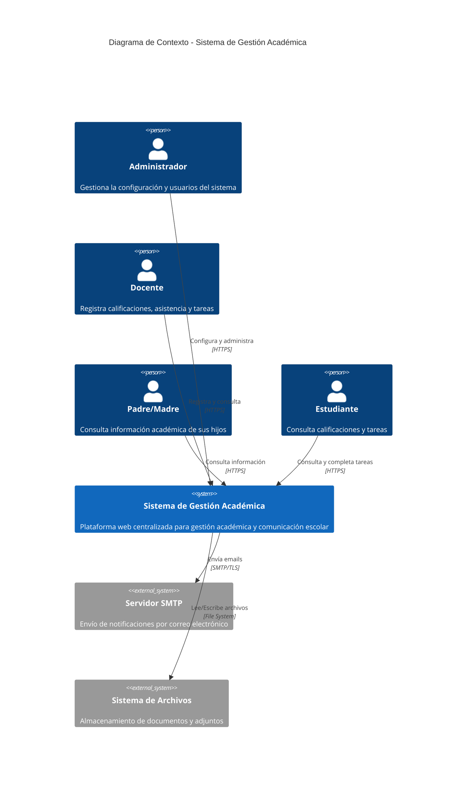
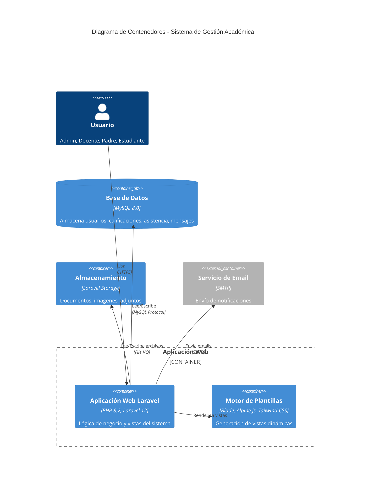
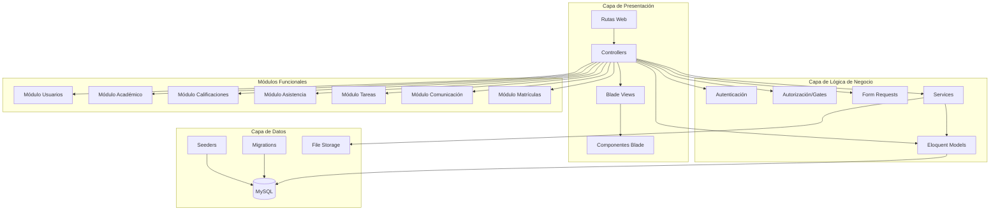
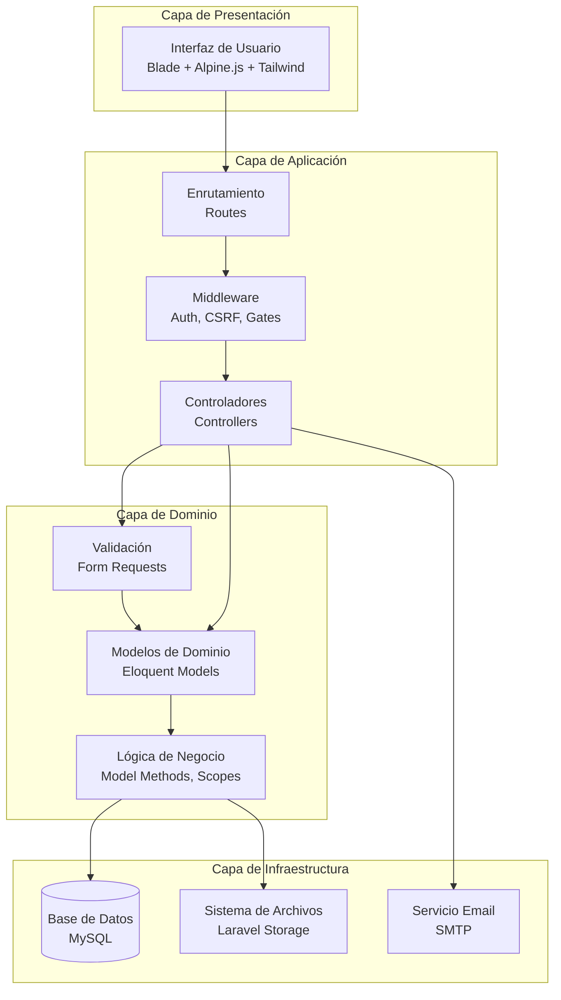
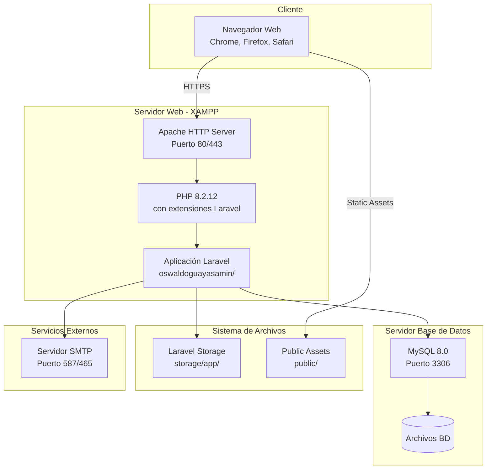

# 🏗️ ARQUITECTURA DEL SISTEMA

**Proyecto:** Sistema de Gestión Académica y Comunicación Escolar  
**Institución:** Unidad Educativa Oswaldo Guayasamín - Galápagos  
**Fecha:** Febrero 2026  
**Versión:** 1.0

---

## 📋 Tabla de Contenidos

1. [Introducción](#introducción)
2. [Modelo C4 - Nivel 1: Contexto](#modelo-c4---nivel-1-contexto)
3. [Modelo C4 - Nivel 2: Contenedores](#modelo-c4---nivel-2-contenedores)
4. [Modelo C4 - Nivel 3: Componentes](#modelo-c4---nivel-3-componentes)
5. [Arquitectura de Capas](#arquitectura-de-capas)
6. [Patrones Arquitectónicos](#patrones-arquitectónicos)
7. [Arquitectura de Despliegue](#arquitectura-de-despliegue)
8. [Decisiones Arquitectónicas](#decisiones-arquitectónicas)

---

## 1. Introducción

### 1.1 Propósito del Documento

Este documento describe la arquitectura del Sistema de Gestión Académica utilizando el modelo C4 (Context, Containers, Components, Code), proporcionando diferentes niveles de abstracción para entender la estructura del sistema.

### 1.2 Alcance

El sistema cubre la gestión completa de procesos académicos incluyendo:
- Gestión de usuarios y autenticación
- Estructura académica (períodos, cursos, materias, paralelos)
- Calificaciones y evaluaciones
- Asistencia y justificaciones
- Tareas y deberes
- Comunicación (mensajes y notificaciones)
- Eventos y calendario
- Reportes y estadísticas

### 1.3 Referencias

- [Requisitos Funcionales y No Funcionales](2%20-%20Requisitos.md)
- [Historias de Usuario](3%20-%20Historias%20de%20Usuario.md)
- [Diagrama de Base de Datos](4%20-%20Diagrama%20DB.md)

---

## 2. Modelo C4 - Nivel 1: Contexto

### 2.1 Diagrama de Contexto



### 2.2 Actores del Sistema

| Actor | Descripción | Responsabilidades |
|-------|-------------|-------------------|
| **Administrador** | Usuario con acceso completo al sistema | Configuración institucional, gestión de usuarios, estructura académica, reportes globales |
| **Docente** | Profesor que imparte clases | Registro de calificaciones, asistencia, tareas, comunicación con padres |
| **Padre/Madre** | Tutor legal del estudiante | Consulta de información académica, justificación de ausencias, comunicación con docentes |
| **Estudiante** | Alumno matriculado | Consulta de calificaciones, tareas, horarios, calendario |

### 2.3 Sistemas Externos

| Sistema | Propósito | Protocolo |
|---------|-----------|-----------|
| **Servidor SMTP** | Envío de notificaciones por email | SMTP/TLS (Puerto 587/465) |
| **Sistema de Archivos** | Almacenamiento de documentos, imágenes, adjuntos | File System (Local/NFS) |

---

## 3. Modelo C4 - Nivel 2: Contenedores

### 3.1 Diagrama de Contenedores



### 3.2 Descripción de Contenedores

#### 3.2.1 Aplicación Web Laravel

**Tecnología:** PHP 8.2.12 + Laravel 12.43.1

**Responsabilidades:**
- Gestión de autenticación y autorización
- Lógica de negocio del sistema
- Procesamiento de peticiones HTTP
- Validación de datos
- Generación de respuestas

**Componentes principales:**
- Controllers (Controladores MVC)
- Models (Modelos Eloquent)
- Middleware (Autenticación, CSRF, etc.)
- Services (Lógica de negocio compleja)
- Requests (Validación de formularios)

**Puerto:** 80 (HTTP) / 443 (HTTPS)

#### 3.2.2 Motor de Plantillas

**Tecnología:** Blade + Alpine.js 3.x + Tailwind CSS 4.x

**Responsabilidades:**
- Renderizado de vistas HTML
- Interactividad del lado del cliente
- Estilos y diseño responsive
- Componentes reutilizables

**Componentes:**
- Layouts (app.blade.php, guest.blade.php)
- Componentes Blade (x-modal, x-enhanced-table, x-session-messages)
- JavaScript (Alpine.js para modales e interactividad)
- CSS (Tailwind CSS para estilos)

#### 3.2.3 Base de Datos MySQL

**Tecnología:** MySQL 8.0

**Responsabilidades:**
- Persistencia de datos
- Integridad referencial
- Transacciones ACID
- Consultas optimizadas con índices

**Esquema:**
- 46 tablas normalizadas
- Relaciones definidas con llaves foráneas
- Índices para optimización de consultas
- Triggers y constraints para integridad

**Ver:** [Diagrama de Base de Datos](4%20-%20Diagrama%20DB.md)

#### 3.2.4 Almacenamiento de Archivos

**Tecnología:** Laravel Storage (File System)

**Estructura:**
```
storage/
├── app/
│   ├── public/              # Archivos públicos (logos)
│   └── private/             # Archivos privados
│       ├── matriculas/      # Documentos de matrícula
│       ├── comprobantes/    # Comprobantes de pago
│       ├── justificaciones/ # Certificados médicos
│       ├── tareas/          # Archivos de tareas
│       └── mensajes/        # Adjuntos de mensajes
```

**Responsabilidades:**
- Almacenamiento seguro de documentos
- Control de acceso por autorización
- Organización por módulos

#### 3.2.5 Servicio de Email (SMTP)

**Tecnología:** SMTP configurable

**Responsabilidades:**
- Envío de notificaciones por email
- Recuperación de contraseñas
- Comunicados institucionales
- Alertas automáticas

**Configuración:**
- Servidor SMTP configurable (Gmail, Mailtrap, etc.)
- Puerto: 587 (TLS) o 465 (SSL)
- Plantillas de email personalizables

---

## 4. Modelo C4 - Nivel 3: Componentes

### 4.1 Diagrama de Componentes Principales



### 4.2 Componentes por Capa

#### 4.2.1 Capa de Presentación

| Componente | Descripción | Archivos |
|------------|-------------|----------|
| **Rutas** | Definición de endpoints HTTP | `routes/web.php`, `routes/auth.php` |
| **Controllers** | Manejo de peticiones HTTP | `app/Http/Controllers/*.php` |
| **Middleware** | Procesamiento pre/post petición | `app/Http/Middleware/*.php` |
| **Views** | Plantillas Blade | `resources/views/**/*.blade.php` |
| **Componentes** | Componentes reutilizables | `resources/views/components/*.blade.php` |

**Componentes Blade Reutilizables:**
- `x-modal` - Modales para crear/editar/eliminar
- `x-enhanced-table` - Tablas con DataTables
- `x-session-messages` - Mensajes flash
- `x-searchable-select` - Selectores con búsqueda

#### 4.2.2 Capa de Lógica de Negocio

| Componente | Descripción | Archivos |
|------------|-------------|----------|
| **Models** | Modelos Eloquent ORM | `app/Models/*.php` |
| **Policies** | Políticas de autorización | `app/Policies/*.php` |
| **Form Requests** | Validación de formularios | `app/Http/Requests/*.php` |
| **Services** | Lógica de negocio compleja | `app/Services/*.php` (si aplica) |

**Modelos Principales:** (46 modelos)
- `User`, `Role`, `Permission` (Autenticación)
- `Institucion`, `Configuracion` (Configuración)
- `PeriodoAcademico`, `Quimestre`, `Parcial` (Estructura temporal)
- `Curso`, `Materia`, `Area`, `Paralelo` (Estructura académica)
- `Docente`, `Estudiante`, `Padre` (Usuarios académicos)
- `Calificacion`, `ComponenteCalificacion` (Evaluaciones)
- `Asistencia`, `Justificacion` (Control de asistencia)
- `Tarea`, `TareaEstudiante` (Deberes)
- `Mensaje`, `Notificacion` (Comunicación)
- `Evento`, `Horario` (Calendario)
- `Matricula`, `SolicitudMatricula`, `OrdenPago` (Matrículas)

#### 4.2.3 Capa de Datos

| Componente | Descripción | Archivos |
|------------|-------------|----------|
| **Migrations** | Definición de esquema BD | `database/migrations/*.php` |
| **Seeders** | Datos de prueba | `database/seeders/*.php` |
| **Factories** | Generación de datos fake | `database/factories/*.php` |

---

## 5. Arquitectura de Capas

### 5.1 Diagrama de Capas



### 5.2 Responsabilidades por Capa

#### Capa de Presentación
- Renderizado de HTML
- Interacciones del usuario
- Estilos y diseño visual
- Validación del lado del cliente

#### Capa de Aplicación
- Orquestación de flujos
- Manejo de peticiones HTTP
- Autenticación y autorización
- Gestión de sesiones

#### Capa de Dominio
- Lógica de negocio
- Validación de datos
- Reglas del negocio
- Cálculos y transformaciones

#### Capa de Infraestructura
- Persistencia de datos
- Almacenamiento de archivos
- Servicios externos
- Configuración del sistema

---

## 6. Patrones Arquitectónicos

### 6.1 MVC (Model-View-Controller)

**Implementación en Laravel:**

```
Request → Route → Middleware → Controller → Model → Database
                                    ↓
                                   View → Response
```

**Ejemplo de flujo:**
```php
// Route
Route::get('calificaciones', [CalificacionController::class, 'index']);

// Controller
public function index() {
    $calificaciones = Calificacion::with(['estudiante', 'materia'])->get();
    return view('calificaciones.index', compact('calificaciones'));
}

// View (calificaciones/index.blade.php)
@foreach($calificaciones as $calif)
    <tr>
        <td>{{ $calif->estudiante->nombre }}</td>
        <td>{{ $calif->nota_final }}</td>
    </tr>
@endforeach
```

### 6.2 Repository Pattern (Implícito con Eloquent)

Laravel utiliza Eloquent ORM que implementa el patrón Repository de forma implícita:

```php
// El modelo actúa como repository
$estudiantes = Estudiante::where('estado', 'activo')
    ->with('matriculas')
    ->orderBy('apellidos')
    ->get();
```

### 6.3 Service Layer Pattern

Para lógica de negocio compleja, se pueden utilizar Services:

```php
class CalificacionService {
    public function calcularPromedioEstudiante($estudianteId, $periodoId) {
        // Lógica compleja de cálculo
    }
    
    public function publicarCalificaciones($paraleloId, $parcialId) {
        // Lógica de publicación masiva
    }
}
```

### 6.4 Observer Pattern

Para eventos del sistema:

```php
// En EventServiceProvider
protected $listen = [
    CalificacionRegistrada::class => [
        NotificarPadreCalificacion::class,
    ],
];
```

### 6.5 Factory Pattern

Para creación de objetos complejos:

```php
// database/factories/EstudianteFactory.php
class EstudianteFactory extends Factory {
    public function definition() {
        return [
            'codigo' => 'EST-' . $this->faker->unique()->numberBetween(1, 9999),
            'cedula' => $this->faker->unique()->numerify('##########'),
            // ...
        ];
    }
}
```

### 6.6 Gate Pattern (Autorización)

```php
// En AuthServiceProvider
Gate::define('editar-calificacion', function (User $user, Calificacion $calificacion) {
    return $user->hasPermissionTo('editar calificaciones') 
        && ($calificacion->estado !== 'publicada' || $user->hasRole('Administrador'));
});
```

---

## 7. Arquitectura de Despliegue

### 7.1 Diagrama de Despliegue



### 7.2 Especificaciones del Servidor

#### Servidor de Desarrollo (XAMPP)

| Componente | Especificación |
|------------|----------------|
| **Sistema Operativo** | Windows 11 |
| **Servidor Web** | Apache 2.4.x |
| **PHP** | 8.2.12 |
| **Base de Datos** | MySQL 8.0 |
| **Memoria RAM** | Mínimo 4GB |
| **Espacio en Disco** | 10GB disponibles |

#### Extensiones PHP Requeridas

```ini
extension=openssl
extension=pdo_mysql
extension=mbstring
extension=tokenizer
extension=xml
extension=ctype
extension=json
extension=bcmath
extension=fileinfo
extension=gd
```

### 7.3 Configuración de Producción Recomendada

#### Servidor Web

```apache
<VirtualHost *:80>
    ServerName oswaldoguayasamin.edu.ec
    DocumentRoot "c:/xampp/htdocs/laravel/oswaldoguayasamin/public"
    
    <Directory "c:/xampp/htdocs/laravel/oswaldoguayasamin/public">
        AllowOverride All
        Require all granted
    </Directory>
    
    ErrorLog "logs/oswaldoguayasamin-error.log"
    CustomLog "logs/oswaldoguayasamin-access.log" common
</VirtualHost>
```

#### Configuración Laravel (.env)

```env
APP_NAME="Sistema Gestión Académica"
APP_ENV=production
APP_KEY=base64:...
APP_DEBUG=false
APP_URL=https://oswaldoguayasamin.edu.ec

DB_CONNECTION=mysql
DB_HOST=127.0.0.1
DB_PORT=3306
DB_DATABASE=oswaldoguayasamin
DB_USERNAME=root
DB_PASSWORD=

FILESYSTEM_DISK=local

MAIL_MAILER=smtp
MAIL_HOST=smtp.gmail.com
MAIL_PORT=587
MAIL_USERNAME=null
MAIL_PASSWORD=null
MAIL_ENCRYPTION=tls
```

---

## 8. Decisiones Arquitectónicas

### 8.1 Registro de Decisiones Arquitectónicas (ADR)

#### ADR-001: Uso de Laravel como Framework

**Fecha:** Diciembre 2025  
**Estado:** Aceptada  
**Contexto:**  
Necesidad de desarrollar rápidamente un sistema web completo con autenticación, autorización, ORM y sistema de plantillas.

**Decisión:**  
Utilizar Laravel 12 como framework PHP principal.

**Consecuencias:**
- ✅ Desarrollo rápido con Eloquent ORM
- ✅ Autenticación y autorización incluidas
- ✅ Sistema de migraciones para control de BD
- ✅ Gran comunidad y documentación
- ⚠️ Curva de aprendizaje inicial
- ⚠️ Requiere PHP 8.2+

#### ADR-002: Sistema Multi-Institución

**Fecha:** Diciembre 2025  
**Estado:** Aceptada  
**Contexto:**  
El sistema podría expandirse a múltiples instituciones educativas.

**Decisión:**  
Implementar arquitectura multi-institución desde el inicio con `institucion_id` en tablas clave.

**Consecuencias:**
- ✅ Escalabilidad a múltiples instituciones
- ✅ Datos aislados por institución
- ✅ Configuraciones independientes
- ⚠️ Mayor complejidad en queries
- ⚠️ Scopes globales necesarios

#### ADR-003: Uso de Blade + Alpine.js para Frontend

**Fecha:** Diciembre 2025  
**Estado:** Aceptada  
**Contexto:**  
Necesidad de interactividad sin complejidad de SPA completo.

**Decisión:**  
Utilizar Blade como motor de plantillas con Alpine.js para interactividad.

**Consecuencias:**
- ✅ Renderizado del lado del servidor (SEO friendly)
- ✅ Interactividad sin framework pesado
- ✅ Desarrollo más rápido
- ⚠️ No es SPA (recarga de página)
- ⚠️ Menor dinamismo que React/Vue

#### ADR-004: Sistema de Permisos con Spatie

**Fecha:** Diciembre 2025  
**Estado:** Aceptada  
**Contexto:**  
Necesidad de control de acceso granular por rol y permiso.

**Decisión:**  
Utilizar paquete Spatie Laravel Permission.

**Consecuencias:**
- ✅ Sistema robusto de roles y permisos
- ✅ Cache de permisos
- ✅ Sintaxis limpia (@can, @canany)
- ✅ Permisos directos a usuarios
- ⚠️ Dependencia de paquete externo

#### ADR-005: Almacenamiento Local de Archivos

**Fecha:** Diciembre 2025  
**Estado:** Aceptada  
**Contexto:**  
Necesidad de almacenar documentos, imágenes y adjuntos de manera segura.

**Decisión:**  
Utilizar Laravel Storage con disco local y estructura de carpetas por módulo.

**Consecuencias:**
- ✅ Control total del almacenamiento
- ✅ No dependencia de servicios externos
- ✅ Acceso controlado por autorización
- ⚠️ No escalable a múltiples servidores
- ⚠️ Requiere backups manuales

#### ADR-006: MySQL como Base de Datos

**Fecha:** Diciembre 2025  
**Estado:** Aceptada  
**Contexto:**  
Necesidad de base de datos relacional con soporte de transacciones.

**Decisión:**  
Utilizar MySQL 8.0 como motor de base de datos.

**Consecuencias:**
- ✅ Base de datos relacional robusta
- ✅ Soporte de transacciones ACID
- ✅ Compatible con XAMPP
- ✅ Gran comunidad y documentación
- ⚠️ Requiere servidor MySQL corriendo

---

## 9. Consideraciones de Seguridad

### 9.1 Medidas Implementadas

| Medida | Implementación | Estado |
|--------|----------------|--------|
| **Autenticación** | Laravel Breeze + Session | ✅ |
| **Autorización** | Gates + Spatie Permissions | ✅ |
| **CSRF Protection** | Token en formularios | ✅ |
| **SQL Injection** | Eloquent ORM + Prepared Statements | ✅ |
| **XSS Prevention** | Blade Auto-escaping | ✅ |
| **Password Hashing** | Bcrypt (Laravel default) | ✅ |
| **HTTPS** | SSL/TLS recomendado en producción | ⚠️ |
| **Rate Limiting** | Throttle middleware | ✅ |

### 9.2 Recomendaciones para Producción

1. **Habilitar HTTPS** con certificado SSL/TLS
2. **Configurar CORS** si se expone API
3. **Limitar intentos de login** (ya implementado)
4. **Backups automáticos** de BD y archivos
5. **Logs de auditoría** de acciones críticas
6. **Firewall** a nivel de servidor
7. **Actualizar dependencias** regularmente

---

## 10. Escalabilidad y Rendimiento

### 10.1 Estrategias de Optimización

#### Cache
```php
// Cache de configuraciones
$config = Cache::remember('institucion.config', 3600, function () {
    return Configuracion::first();
});

// Cache de permisos (Spatie)
// Ya implementado automáticamente
```

#### Eager Loading
```php
// Prevenir N+1 queries
$estudiantes = Estudiante::with(['matriculas.paralelo', 'padres'])
    ->where('estado', 'activo')
    ->get();
```

#### Índices de Base de Datos
```php
// Ya implementados en migraciones
Schema::table('calificaciones', function (Blueprint $table) {
    $table->index(['matricula_id', 'parcial_id']);
    $table->index(['curso_materia_id', 'docente_id']);
});
```

### 10.2 Límites y Capacidad

| Métrica | Límite Actual | Límite Recomendado |
|---------|---------------|---------------------|
| **Usuarios concurrentes** | ~50 | 100-200 |
| **Estudiantes** | ~1000 | 2000-3000 |
| **Calificaciones/año** | ~50,000 | 100,000+ |
| **Tamaño BD** | ~500MB | 2-5GB |
| **Archivos almacenados** | ~5GB | 20-50GB |

---

## 11. Mantenibilidad

### 11.1 Estructura del Código

```
oswaldoguayasamin/
├── app/
│   ├── Http/
│   │   ├── Controllers/      # Controladores por módulo
│   │   ├── Middleware/       # Middleware custom
│   │   └── Requests/         # Validación de formularios
│   ├── Models/               # Modelos Eloquent (46 archivos)
│   ├── Policies/             # Políticas de autorización
│   └── Providers/            # Service providers
├── database/
│   ├── migrations/           # Migraciones de BD (46 tablas)
│   ├── seeders/              # Datos de prueba (13 seeders)
│   └── factories/            # Factories para testing
├── resources/
│   ├── views/                # Vistas Blade organizadas por módulo
│   ├── css/                  # Tailwind CSS
│   └── js/                   # Alpine.js
├── routes/
│   ├── web.php               # Rutas principales
│   └── auth.php              # Rutas de autenticación
└── storage/
    └── app/
        ├── public/           # Archivos públicos
        └── private/          # Archivos privados por módulo
```

### 11.2 Convenciones de Código

- **PSR-12** para estándares de código PHP
- **Nombres descriptivos** en español para BD y modelos
- **Comentarios** en código complejo
- **Migraciones** para todos los cambios de BD
- **Seeders** para datos de prueba
- **Form Requests** para validación

---

## 12. Conclusión

### 12.1 Resumen de la Arquitectura

El Sistema de Gestión Académica utiliza una **arquitectura en capas** basada en el patrón **MVC** de Laravel, con clara separación de responsabilidades:

1. **Presentación:** Blade + Alpine.js + Tailwind CSS
2. **Aplicación:** Controllers + Middleware + Routes
3. **Dominio:** Models + Validation + Business Logic
4. **Infraestructura:** MySQL + Storage + SMTP

### 12.2 Fortalezas Arquitectónicas

- ✅ **Modular:** 10 módulos funcionales independientes
- ✅ **Escalable:** Arquitectura multi-institución
- ✅ **Segura:** Múltiples capas de seguridad
- ✅ **Mantenible:** Código organizado y documentado
- ✅ **Extensible:** Fácil agregar nuevas funcionalidades

### 12.3 Áreas de Mejora Futura

1. **API RESTful:** Para integración con apps móviles
2. **Cache distribuido:** Redis para mejor rendimiento
3. **Microservicios:** Separar módulos críticos
4. **Cloud Storage:** S3 para archivos
5. **Monitoring:** Herramientas de APM (New Relic, etc.)

---

**Documento preparado por:** Equipo de Desarrollo  
**Revisado por:** Arquitecto de Software  
**Fecha de última actualización:** Febrero 2026  
**Versión:** 1.0
