# 📐 DIAGRAMA DE COMPONENTES DEL SISTEMA

**Proyecto:** Sistema de Gestión Académica y Comunicación Escolar  
**Institución:** Unidad Educativa Oswaldo Guayasamín - Galápagos  
**Fecha:** Febrero 2026  
**Versión:** 1.0

---

## 📋 Tabla de Contenidos

1. [Introducción](#introducción)
2. [Vista General de Componentes](#vista-general-de-componentes)
3. [Componentes por Módulo](#componentes-por-módulo)
4. [Componentes Transversales](#componentes-transversales)
5. [Interfaces y Dependencias](#interfaces-y-dependencias)
6. [Flujo de Datos](#flujo-de-datos)

---

## 1. Introducción

Este documento describe la arquitectura de componentes del sistema, detallando los módulos funcionales, sus responsabilidades, interfaces y dependencias.

---

## 2. Vista General de Componentes

### 2.1 Diagrama de Componentes de Alto Nivel

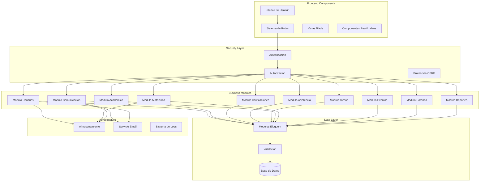

---

## 3. Componentes por Módulo

### 3.1 Módulo de Usuarios y Autenticación

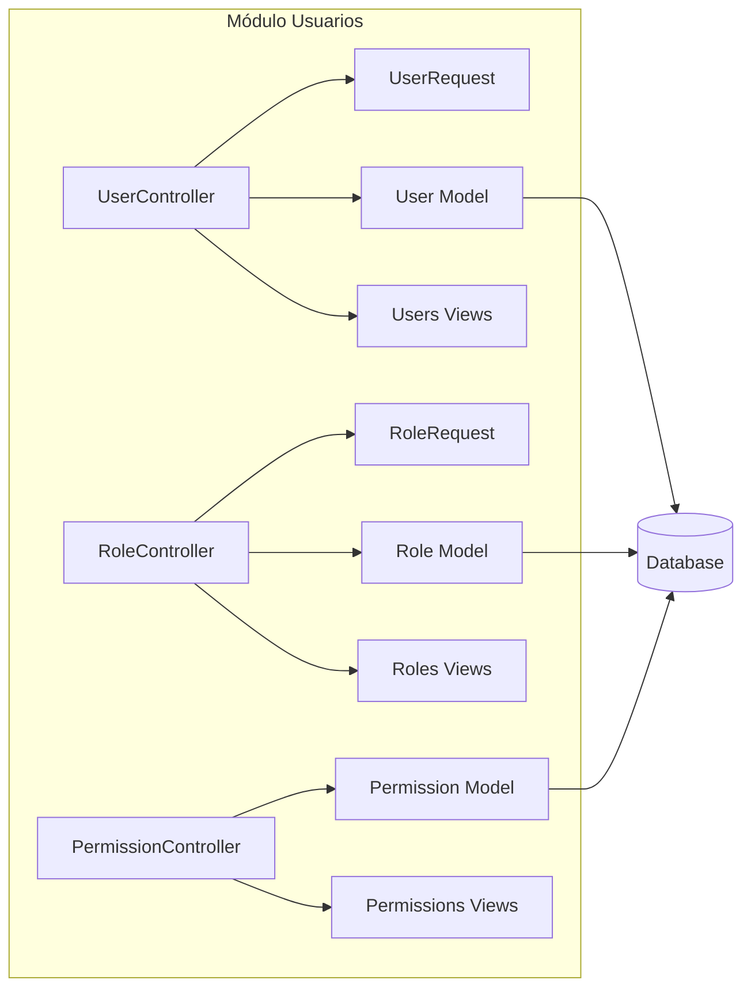

**Componentes:**

| Componente | Tipo | Responsabilidad |
|------------|------|-----------------|
| `UserController` | Controller | CRUD de usuarios |
| `RoleController` | Controller | Gestión de roles |
| `PermissionController` | Controller | Gestión de permisos |
| `User` | Model | Entidad usuario |
| `Role` | Model | Entidad rol (Spatie) |
| `Permission` | Model | Entidad permiso (Spatie) |
| `UserRequest` | Form Request | Validación de usuarios |
| `usuarios/*.blade.php` | Views | Interfaz de usuarios |

**Interfaces:**
- `authenticate()` - Autenticación de usuario
- `authorize()` - Verificación de permisos
- `assignRole()` - Asignación de roles
- `grantPermission()` - Otorgar permisos

---

### 3.2 Módulo Académico

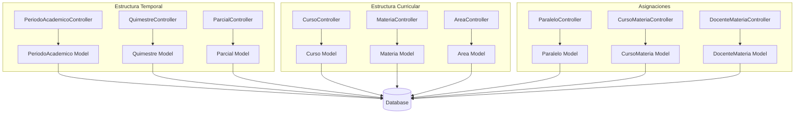

**Componentes:**

**Estructura Temporal:**
| Componente | Responsabilidad |
|------------|-----------------|
| `PeriodoAcademicoController` | Gestión de años lectivos |
| `QuimestreController` | Gestión de quimestres |
| `ParcialController` | Gestión de parciales |

**Estructura Curricular:**
| Componente | Responsabilidad |
|------------|-----------------|
| `CursoController` | Gestión de cursos/grados |
| `MateriaController` | Gestión de materias |
| `AreaController` | Gestión de áreas curriculares |

**Asignaciones:**
| Componente | Responsabilidad |
|------------|-----------------|
| `ParaleloController` | Gestión de paralelos |
| `CursoMateriaController` | Asignación materia-curso |
| `DocenteMateriaController` | Asignación docente-materia-paralelo |

**Interfaces:**
- `createPeriodo()` - Crear período académico
- `assignMateria()` - Asignar materia a curso
- `assignDocente()` - Asignar docente a materia

---

### 3.3 Módulo de Calificaciones

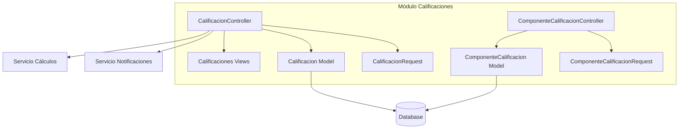

**Componentes:**

| Componente | Tipo | Responsabilidad |
|------------|------|-----------------|
| `CalificacionController` | Controller | Gestión de calificaciones |
| `ComponenteCalificacionController` | Controller | Gestión de componentes |
| `Calificacion` | Model | Entidad calificación |
| `ComponenteCalificacion` | Model | Componente de evaluación |
| `CalificacionRequest` | Form Request | Validación de calificaciones |

**Lógica de Negocio:**
- Cálculo automático de nota final ponderada
- Validación de rangos (0-10)
- Publicación masiva de calificaciones
- Generación de estadísticas
- Identificación de estudiantes en riesgo

**Interfaces:**
- `registrarCalificacion()` - Registrar nota
- `calcularPromedio()` - Calcular promedio
- `publicarCalificaciones()` - Publicar masivamente
- `generarEstadisticas()` - Estadísticas del curso

---

### 3.4 Módulo de Asistencia

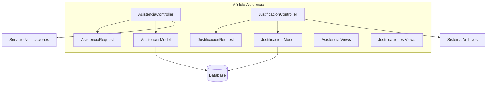

**Componentes:**

| Componente | Responsabilidad |
|------------|-----------------|
| `AsistenciaController` | Registro de asistencia diaria |
| `JustificacionController` | Gestión de justificaciones |
| `Asistencia` | Entidad asistencia |
| `Justificacion` | Entidad justificación |

**Lógica de Negocio:**
- Registro diario por clase
- Estados: presente, ausente, atrasado, justificado
- Cálculo de porcentaje de asistencia
- Alertas por límite de inasistencias
- Aprobación/rechazo de justificaciones

**Interfaces:**
- `registrarAsistencia()` - Registrar asistencia
- `justificarAusencia()` - Crear justificación
- `aprobarJustificacion()` - Aprobar/rechazar
- `calcularPorcentaje()` - Calcular asistencia

---

### 3.5 Módulo de Tareas

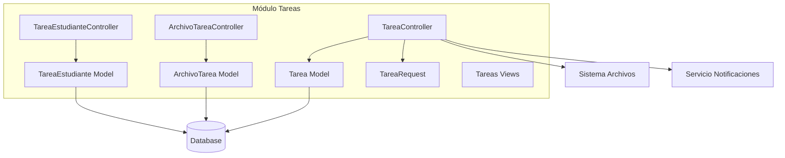

**Componentes:**

| Componente | Responsabilidad |
|------------|-----------------|
| `TareaController` | Gestión de tareas |
| `ArchivoTareaController` | Archivos adjuntos |
| `TareaEstudianteController` | Seguimiento por estudiante |
| `Tarea` | Entidad tarea |
| `ArchivoTarea` | Archivo adjunto |
| `TareaEstudiante` | Relación tarea-estudiante |

**Lógica de Negocio:**
- Creación y asignación de tareas
- Gestión de archivos adjuntos
- Seguimiento de completitud
- Calificación de tareas
- Alertas de vencimiento

**Interfaces:**
- `crearTarea()` - Crear y asignar
- `adjuntarArchivo()` - Agregar archivo
- `marcarCompletada()` - Completar tarea
- `calificarTarea()` - Asignar calificación

---

### 3.6 Módulo de Comunicación

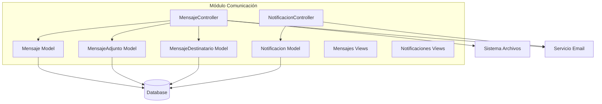

**Componentes:**

| Componente | Responsabilidad |
|------------|-----------------|
| `MensajeController` | Gestión de mensajes |
| `NotificacionController` | Gestión de notificaciones |
| `Mensaje` | Entidad mensaje |
| `MensajeAdjunto` | Archivo adjunto |
| `MensajeDestinatario` | Destinatarios masivos |
| `Notificacion` | Entidad notificación |

**Tipos de Mensajes:**
- **Individual:** Un remitente, un destinatario
- **Masivo:** Un remitente, múltiples destinatarios
- **Anuncio:** Comunicado institucional

**Lógica de Negocio:**
- Envío de mensajes individuales/masivos
- Adjuntos de archivos
- Notificaciones en tiempo real
- Envío de emails configurables
- Programación de envíos

**Interfaces:**
- `enviarMensaje()` - Enviar mensaje
- `crearNotificacion()` - Crear notificación
- `marcarLeido()` - Marcar como leído
- `enviarEmail()` - Enviar por correo

---

### 3.7 Módulo de Matrículas

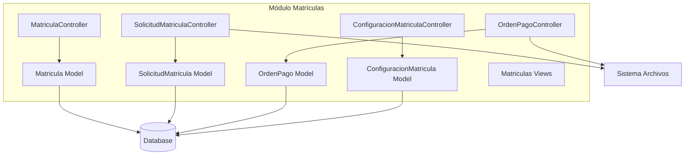

**Componentes:**

| Componente | Responsabilidad |
|------------|-----------------|
| `MatriculaController` | Gestión de matrículas |
| `SolicitudMatriculaController` | Solicitudes de matrícula |
| `OrdenPagoController` | Órdenes de pago |
| `ConfiguracionMatriculaController` | Costos de matrícula |

**Flujo de Negocio:**
1. **Solicitud** → Estudiante/externo solicita matrícula
2. **Revisión** → Admin revisa y aprueba/rechaza
3. **Orden de Pago** → Se genera orden si es aprobada
4. **Comprobante** → Usuario sube comprobante
5. **Verificación** → Admin verifica pago
6. **Matrícula** → Se crea matrícula oficial

**Lógica Especial:**
- Máximo 2 matrículas por curso
- Bloqueo si reprueba segunda matrícula
- Soporte multi-institución
- Documentos adjuntos (cédula, certificados)

---

### 3.8 Módulo de Eventos y Calendario

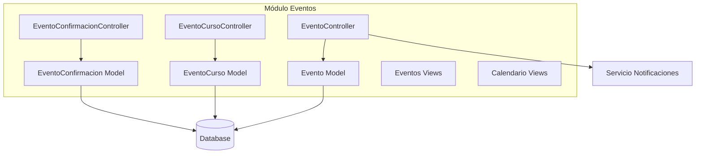

**Componentes:**

| Componente | Responsabilidad |
|------------|-----------------|
| `EventoController` | Gestión de eventos |
| `EventoCurso` | Asociación evento-paralelo |
| `EventoConfirmacion` | Confirmaciones de asistencia |

**Tipos de Eventos:**
- Examen
- Reunión
- Actividad
- Feriado
- Ceremonia
- Otro

**Lógica de Negocio:**
- Creación de eventos institucionales
- Asignación a paralelos específicos
- Confirmación de asistencia
- Recordatorios automáticos
- Calendario visual

---

### 3.9 Módulo de Horarios

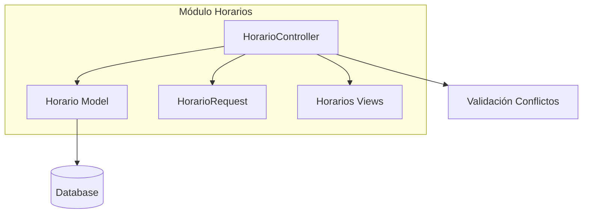

**Componentes:**

| Componente | Responsabilidad |
|------------|-----------------|
| `HorarioController` | Gestión de horarios |
| `Horario` | Entidad horario |
| `HorarioRequest` | Validación de horarios |

**Lógica de Negocio:**
- Programación de clases semanales
- Validación de conflictos (docente/aula)
- Grid semanal por paralelo
- Horario por docente
- Disponibilidad de aulas

---

### 3.10 Módulo de Reportes

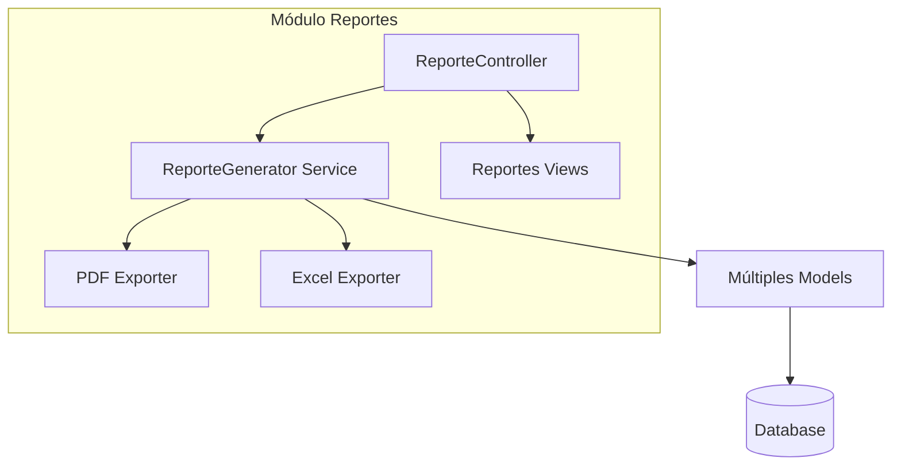

**Tipos de Reportes:**

| Reporte | Descripción |
|---------|-------------|
| **Boletín de Calificaciones** | PDF individual por estudiante |
| **Reporte de Asistencia** | Individual o por curso |
| **Listado de Estudiantes** | Por diversos criterios |
| **Estadísticas de Curso** | Rendimiento académico |
| **Estudiantes en Riesgo** | Promedio < 7.0 |
| **Certificados de Notas** | Documentos oficiales |

**Formatos:**
- PDF (usando DomPDF o similar)
- Excel (usando Maatwebsite Excel)
- CSV (exportación simple)

---

## 4. Componentes Transversales

### 4.1 Sistema de Autenticación

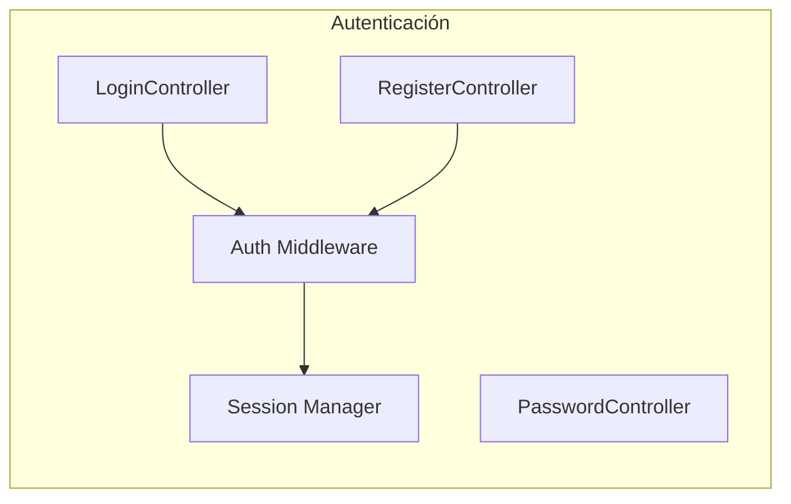

**Funcionalidades:**
- Login con email y contraseña
- Registro de nuevos usuarios
- Recuperación de contraseña
- Cierre de sesión
- Sesiones persistentes

---

### 4.2 Sistema de Autorización

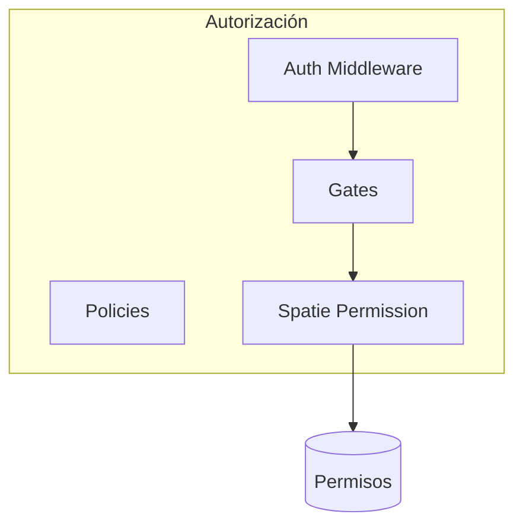

**Componentes:**
- **Gates:** Definición de autorizaciones
- **Policies:** Políticas por modelo
- **Spatie Permission:** Sistema de roles y permisos
- **Middleware:** Protección de rutas

**Permisos por Módulo:**
- `gestionar [módulo]`
- `ver [módulo]`
- `crear [módulo]`
- `editar [módulo]`
- `eliminar [módulo]`

---

### 4.3 Componentes Blade Reutilizables

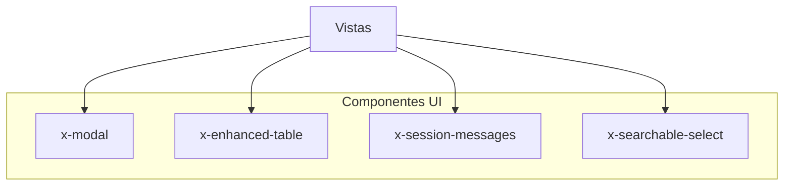

**Componentes:**

| Componente | Propósito | Uso |
|------------|-----------|-----|
| `x-modal` | Modales para CRUD | Crear/Editar/Eliminar |
| `x-enhanced-table` | Tablas con DataTables | Listados paginados |
| `x-session-messages` | Mensajes flash | Success/Error/Info |
| `x-searchable-select` | Select con búsqueda | Selección con muchas opciones |

---

### 4.4 Sistema de Validación

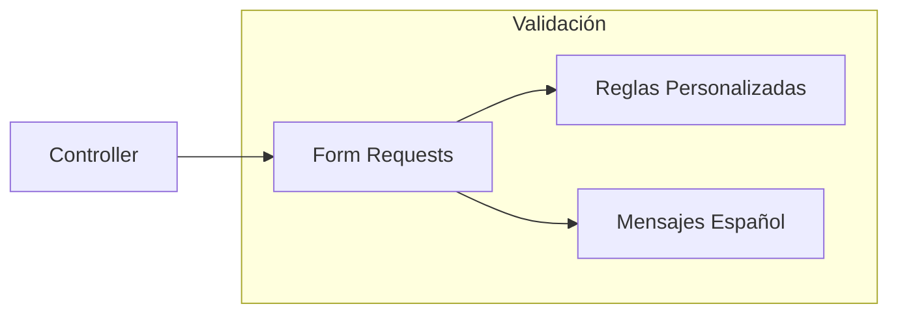

**Form Requests por Módulo:**
- `UserRequest`
- `CalificacionRequest`
- `AsistenciaRequest`
- `TareaRequest`
- `MensajeRequest`
- (etc.)

**Validaciones Comunes:**
- Campos requeridos
- Formatos (email, fecha)
- Rangos (0-10 para notas)
- Unicidad
- Relaciones existentes

---

### 4.5 Sistema de Almacenamiento

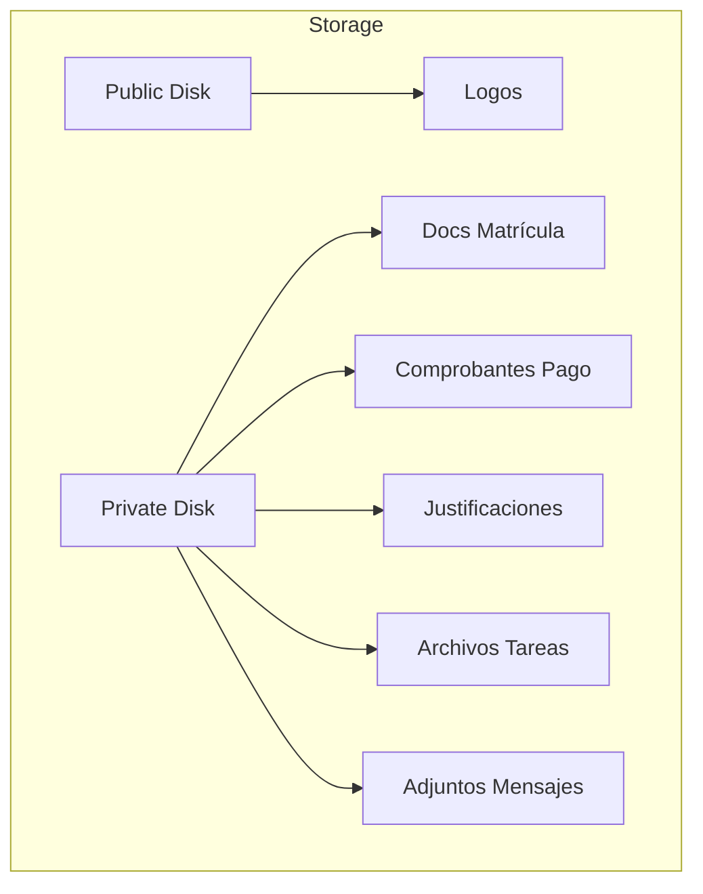

**Estructura:**
```
storage/
├── app/
│   ├── public/
│   │   └── logos/
│   └── private/
│       ├── matriculas/
│       │   ├── cedulas/
│       │   └── certificados/
│       ├── comprobantes/
│       ├── justificaciones/
│       ├── tareas/
│       └── mensajes/
```

---

### 4.6 Sistema de Notificaciones

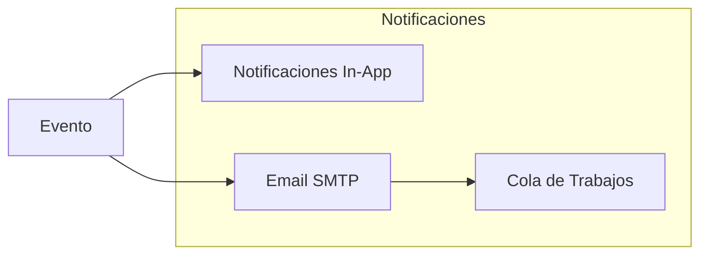

**Tipos de Notificaciones:**
- Nueva calificación registrada
- Ausencia de estudiante
- Nueva tarea asignada
- Tarea próxima a vencer
- Nuevo mensaje recibido
- Evento próximo
- Justificación procesada

---

## 5. Interfaces y Dependencias

### 5.1 Matriz de Dependencias

| Módulo | Depende de | Es usado por |
|--------|------------|--------------|
| **Usuarios** | Spatie Permission | Todos los módulos |
| **Académico** | Usuarios | Calificaciones, Asistencia, Tareas, Horarios |
| **Calificaciones** | Académico, Usuarios | Reportes |
| **Asistencia** | Académico, Usuarios | Reportes |
| **Tareas** | Académico, Usuarios | Reportes |
| **Comunicación** | Usuarios, Email | Todos (notificaciones) |
| **Matrículas** | Usuarios, Académico, Storage | Reportes |
| **Eventos** | Académico, Usuarios | Calendario |
| **Horarios** | Académico | - |
| **Reportes** | Todos | - |

### 5.2 Acoplamiento entre Módulos

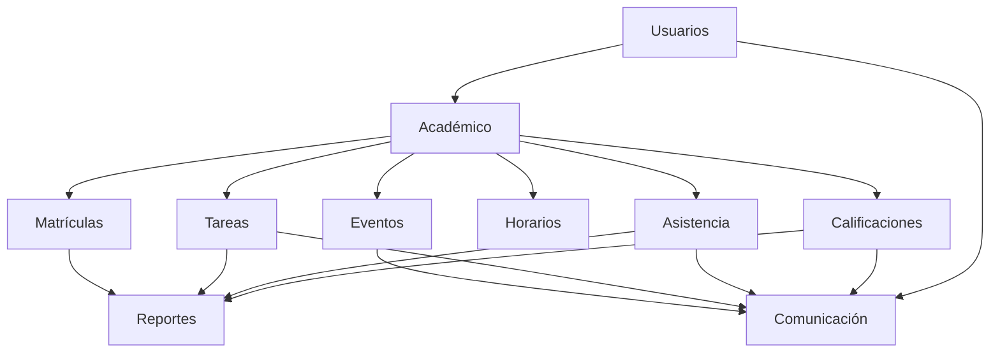

---

## 6. Flujo de Datos

### 6.1 Flujo de Registro de Calificación

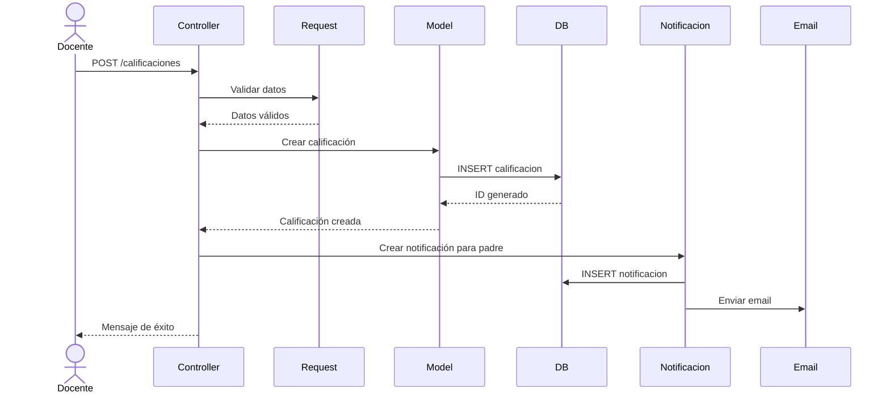

### 6.2 Flujo de Matriculación

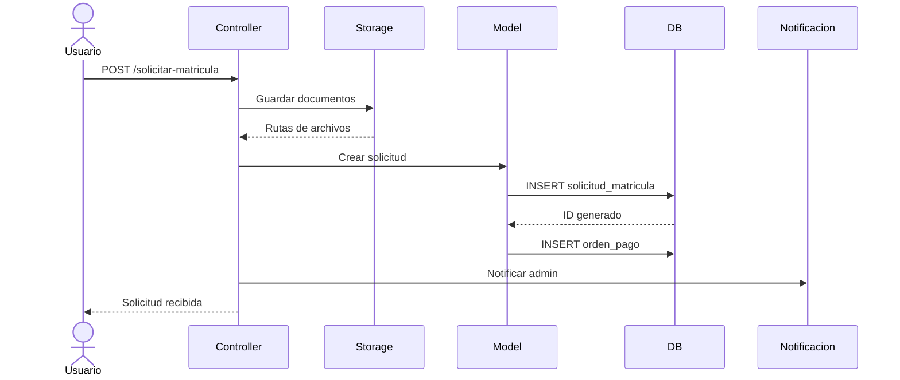

### 6.3 Flujo de Autenticación

```mermaid
sequenceDiagram
    actor Usuario
    participant LoginController
    participant Auth
    participant Session
    participant DB
    participant Dashboard
    
    Usuario->>LoginController: POST /login
    LoginController->>Auth: Intentar autenticar
    Auth->>DB: Verificar credenciales
    DB-->>Auth: Usuario encontrado
    Auth->>Session: Crear sesión
    Session-->>Auth: Sesión creada
    Auth-->>LoginController: Autenticado
    LoginController->>Dashboard: Redirigir a dashboard
    Dashboard-->>Usuario: Vista según rol
```

---

## 7. Convenciones y Estándares

### 7.1 Nomenclatura de Componentes

| Tipo | Convención | Ejemplo |
|------|------------|---------|
| **Controller** | `{Entidad}Controller` | `CalificacionController` |
| **Model** | `{Entidad}` (singular) | `Calificacion` |
| **Request** | `{Entidad}Request` | `CalificacionRequest` |
| **View** | `{módulo}/{vista}.blade.php` | `calificaciones/index.blade.php` |
| **Component** | `x-{nombre}` | `x-modal` |

### 7.2 Estructura de Archivos

```
app/Http/Controllers/
├── AcademicoController.php
├── AsistenciaController.php
├── CalificacionController.php
├── ComponenteCalificacionController.php
├── ConfiguracionController.php
├── ConfiguracionMatriculaController.php
├── CursoController.php
├── CursoMateriaController.php
├── DocenteController.php
├── DocenteMateriaController.php
├── EstudianteController.php
├── EventoController.php
├── HorarioController.php
├── InstitucionController.php
├── JustificacionController.php
├── MateriaController.php
├── MatriculaController.php
├── MensajeController.php
├── NotificacionController.php
├── OrdenPagoController.php
├── PadreController.php
├── ParaleloController.php
├── ParcialController.php
├── PeriodoAcademicoController.php
├── ProfileController.php
├── QuimestreController.php
├── RoleController.php
├── SolicitudMatriculaController.php
├── TareaController.php
└── UserController.php
```

---

## 8. Conclusión

### 8.1 Resumen de Componentes

El sistema está compuesto por:

- **10 módulos funcionales** principales
- **46 modelos** de dominio
- **30+ controladores** de aplicación
- **25+ form requests** de validación
- **100+ vistas** Blade
- **4 componentes** reutilizables

### 8.2 Principios Aplicados

✅ **Separación de Responsabilidades:** Cada componente tiene una función específica  
✅ **Bajo Acoplamiento:** Módulos independientes comunicados por interfaces  
✅ **Alta Cohesión:** Componentes relacionados agrupados en módulos  
✅ **Reutilización:** Componentes Blade y servicios compartidos  
✅ **Escalabilidad:** Arquitectura modular permite crecimiento

---

**Documento preparado por:** Equipo de Desarrollo  
**Fecha:** Febrero 2026  
**Versión:** 1.0
