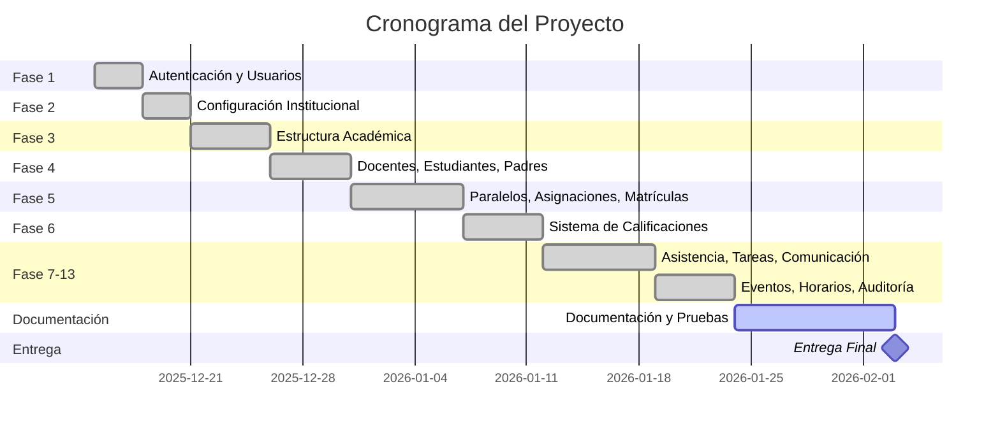

# 📅 PLANIFICACIÓN DEL PROYECTO

**Proyecto:** Sistema de Gestión Académica y Comunicación Escolar  
**Institución:** Unidad Educativa Oswaldo Guayasamín - Galápagos  
**Fecha de inicio:** Diciembre 2025  
**Fecha de entrega:** Febrero 2026  
**Versión:** 1.0

---

## 📋 Tabla de Contenidos

1. [Resumen Ejecutivo](#resumen-ejecutivo)
2. [Alcance del Proyecto](#alcance-del-proyecto)
3. [Equipo del Proyecto](#equipo-del-proyecto)
4. [Cronograma y Fases](#cronograma-y-fases)
5. [Sprints y Backlog](#sprints-y-backlog)
6. [Recursos y Presupuesto](#recursos-y-presupuesto)
7. [Gestión de Riesgos](#gestión-de-riesgos)
8. [Hitos del Proyecto](#hitos-del-proyecto)
9. [Métricas y Seguimiento](#métricas-y-seguimiento)

---

## 1. Resumen Ejecutivo

### 1.1 Objetivos del Proyecto

**Objetivo General:**  
Desarrollar una plataforma web centralizada para la gestión académica y comunicación escolar de la Unidad Educativa Oswaldo Guayasamín en Galápagos.

**Objetivos Específicos:**
1. Automatizar el registro de calificaciones, tareas y asistencias
2. Facilitar la comunicación entre docentes, padres y estudiantes
3. Proporcionar acceso en tiempo real a información académica
4. Generar reportes académicos automáticos
5. Funcionar eficientemente con conectividad limitada

### 1.2 Justificación

La institución actualmente maneja procesos de forma manual usando hojas de cálculo, WhatsApp y documentos físicos, generando:
- Retrasos en entrega de calificaciones
- Pérdida de información
- Duplicidad de registros
- Falta de trazabilidad
- Comunicación informal e ineficiente

### 1.3 Beneficios Esperados

| Beneficio | Descripción | Impacto |
|-----------|-------------|---------|
| **Eficiencia** | Reducción del 70% en tiempo de registro | Alto |
| **Transparencia** | Acceso en tiempo real a información | Alto |
| **Comunicación** | Canales formales y trazables | Alto |
| **Reportes** | Generación automática de documentos | Medio |
| **Trazabilidad** | Auditoría completa de acciones | Medio |

---

## 2. Alcance del Proyecto

### 2.1 Funcionalidades Incluidas

✅ **Gestión de Usuarios y Autenticación**
- Sistema de roles y permisos
- Autenticación segura
- Recuperación de contraseñas

✅ **Estructura Académica**
- Períodos académicos, quimestres, parciales
- Cursos, materias, áreas, paralelos
- Asignación de docentes a materias

✅ **Gestión de Personas**
- Docentes, estudiantes, padres
- Relaciones estudiante-padre
- Perfiles completos

✅ **Calificaciones**
- Registro de calificaciones por componentes
- Cálculo automático de promedios
- Publicación de calificaciones
- Estadísticas de rendimiento

✅ **Asistencia** (Backend completo)
- Registro diario de asistencia
- Justificaciones con documentos
- Cálculo de porcentajes

✅ **Tareas y Deberes** (Backend completo)
- Creación y asignación de tareas
- Archivos adjuntos
- Seguimiento por estudiante

✅ **Comunicación** (Backend completo)
- Mensajería individual y masiva
- Notificaciones en tiempo real
- Envío de emails

✅ **Matrículas**
- Solicitudes de matrícula
- Órdenes de pago
- Comprobantes
- Configuración de costos

✅ **Eventos y Calendario** (Backend completo)
- Gestión de eventos académicos
- Confirmaciones de asistencia
- Calendario institucional

✅ **Horarios** (Backend completo)
- Programación de clases
- Detección de conflictos

✅ **Reportes**
- Boletines de calificaciones
- Reportes de asistencia
- Estadísticas institucionales

### 2.2 Funcionalidades Excluidas

❌ **Aplicación Móvil Nativa**  
❌ **API RESTful Pública**  
❌ **Integración con Sistemas Externos** (Banco, Ministerio)  
❌ **Plataforma de Videoconferencias**  
❌ **Sistema de Biblioteca**  
❌ **Sistema Financiero Completo**  

### 2.3 Límites del Proyecto

| Aspecto | Límite |
|---------|--------|
| **Usuarios** | Máximo 1000 estudiantes |
| **Concurrencia** | 50-100 usuarios simultáneos |
| **Almacenamiento** | 10-20 GB |
| **Tamaño archivos** | Máximo 5MB por archivo |
| **Idioma** | Solo español |
| **Navegadores** | Chrome, Firefox, Safari (últimas 2 versiones) |

---

## 3. Equipo del Proyecto

### 3.1 Roles y Responsabilidades

| Rol | Responsable | Responsabilidades |
|-----|-------------|-------------------|
| **Product Owner** | Dirección UEOG | Definir requisitos, priorizar backlog |
| **Scrum Master** | Líder Técnico | Facilitar sprints, remover impedimentos |
| **Desarrollador Full-Stack** | Equipo Dev | Backend (Laravel) + Frontend (Blade) |
| **Diseñador UI/UX** | Equipo Dev | Mockups, estilos, experiencia de usuario |
| **Tester** | Equipo QA | Pruebas funcionales, reportes de bugs |
| **DBA** | Equipo Dev | Diseño de BD, optimización |

### 3.2 Stakeholders

| Stakeholder | Interés | Nivel de Influencia |
|-------------|---------|---------------------|
| **Rector** | Aprobación final del proyecto | Alto |
| **Vicerrector** | Supervisión académica | Alto |
| **Docentes** | Usuarios principales del sistema | Alto |
| **Padres de familia** | Acceso a información | Medio |
| **Estudiantes** | Consulta de información | Medio |
| **Personal administrativo** | Gestión de matrículas | Alto |

---

## 4. Cronograma y Fases

### 4.1 Cronograma General

**Duración total:** 10 semanas (Diciembre 2025 - Febrero 2026)



### 4.2 Desglose por Fase

#### **FASE 1: Autenticación y Registro** ✅
**Duración:** 3 días  
**Fecha:** 15-17 Diciembre 2025  
**Estado:** Completada

**Entregables:**
- Login y registro de usuarios
- Recuperación de contraseñas
- Sistema de roles básico
- Gestión de perfiles

**Métricas:**
- 4 vistas implementadas
- 3 controladores
- 100% funcional

---

#### **FASE 2: Configuración Institucional** ✅
**Duración:** 3 días  
**Fecha:** 18-20 Diciembre 2025  
**Estado:** Completada

**Entregables:**
- CRUD de instituciones
- Configuraciones del sistema (4 pestañas)
- Sistema multi-institución
- Test de correo SMTP

**Métricas:**
- 2 módulos implementados
- 5 vistas + 4 tabs
- 2 modelos con relaciones

---

#### **FASE 3: Estructura Académica** ✅
**Duración:** 5 días  
**Fecha:** 21-25 Diciembre 2025  
**Estado:** Completada

**Entregables:**
- Períodos académicos, quimestres, parciales
- Cursos, materias, áreas
- Aulas
- Sistema de colores para materias

**Métricas:**
- 7 módulos CRUD completos
- 35+ vistas
- 7 controladores

---

#### **FASE 4: Gestión de Personas** ✅
**Duración:** 5 días  
**Fecha:** 26-30 Diciembre 2025  
**Estado:** Completada

**Entregables:**
- CRUD de docentes
- CRUD de estudiantes
- CRUD de padres
- Relaciones estudiante-padre
- Generación automática de códigos

**Métricas:**
- 3 módulos completos
- 21 vistas
- 3,800+ líneas de código

---

#### **FASE 5: Asignaciones y Matrículas** ✅
**Duración:** 7 días  
**Fecha:** 31 Diciembre 2025 - 6 Enero 2026  
**Estado:** Completada

**Entregables:**
- Gestión de paralelos (cards)
- Asignación curso-materia
- Asignación docente-materia-paralelo
- Sistema completo de matrículas
  - Solicitudes de matrícula
  - Órdenes de pago
  - Configuración de costos
  - Flujo multi-institución

**Métricas:**
- 4 módulos principales
- 13 permisos nuevos
- Sistema de archivos privado
- Flujo completo externo/interno

---

#### **FASE 6: Sistema de Calificaciones** ✅
**Duración:** 5 días  
**Fecha:** 7-11 Enero 2026  
**Estado:** Completada

**Entregables:**
- Registro de calificaciones con contexto
- Componentes de calificación
- Cálculo automático de nota final
- Publicación masiva
- Estadísticas de rendimiento
- Sistema de colores por nota

**Métricas:**
- 2 módulos implementados
- 12 permisos
- 294 calificaciones de prueba
- 1,176 componentes de prueba

---

#### **FASE 7-13: Módulos Backend** ✅
**Duración:** 12 días  
**Fecha:** 12-23 Enero 2026  
**Estado:** Backend Completado

**Entregables:**
- **Fase 7:** Asistencia (backend)
- **Fase 8:** Justificaciones (backend)
- **Fase 9:** Tareas y deberes (backend)
- **Fase 10:** Mensajes y notificaciones (backend)
- **Fase 11:** Eventos y calendario (backend)
- **Fase 12:** Horarios (backend)
- **Fase 13:** Auditoría de accesos (backend)

**Métricas:**
- 46/46 tablas completadas (100%)
- 46 modelos con relaciones
- Seeders con datos de prueba
- Documentación completa

**Estado Frontend:**
- ⚠️ 9 módulos pendientes de interfaz
- 76.3% de frontend completado

---

#### **FASE ACTUAL: Documentación y Pruebas** 🔄
**Duración:** 10 días  
**Fecha:** 24 Enero - 3 Febrero 2026  
**Estado:** En Progreso

**Entregables pendientes:**
- ✅ Documentación de arquitectura
- ✅ Diagrama de componentes
- ✅ Planificación del proyecto (este documento)
- ⏳ Pruebas funcionales
- ⏳ Análisis SonarQube
- ⏳ Pruebas de integración
- ⏳ Pruebas de usabilidad (SUS)
- ⏳ Pruebas de accesibilidad (WCAG)
- ⏳ Pruebas de seguridad

---

## 5. Sprints y Backlog

### 5.1 Mapeo de Fases a Sprints

| Sprint | Fase | Duración | HU Principales |
|--------|------|----------|----------------|
| **Sprint 0** | Setup | 2 días | Configuración entorno |
| **Sprint 1** | Fase 1 | 3 días | HU-001, HU-002, HU-003 |
| **Sprint 2** | Fase 2 | 3 días | HU-031 (Configuración) |
| **Sprint 3** | Fase 3 (parte 1) | 3 días | HU-004, HU-005 |
| **Sprint 4** | Fase 3 (parte 2) | 2 días | HU-006, HU-008 |
| **Sprint 5** | Fase 4 | 5 días | HU-007 (Personas) |
| **Sprint 6** | Fase 5 (parte 1) | 4 días | Asignaciones académicas |
| **Sprint 7** | Fase 5 (parte 2) | 3 días | Sistema matrículas |
| **Sprint 8** | Fase 6 | 5 días | HU-009, HU-010, HU-011 |
| **Sprint 9** | Fases 7-8 | 4 días | HU-012, HU-013, HU-014 |
| **Sprint 10** | Fases 9-10 | 4 días | HU-015 a HU-020 |
| **Sprint 11** | Fases 11-13 | 4 días | HU-028, HU-029, HU-008 |
| **Sprint 12** | Documentación | 10 días | Pruebas y documentos |

### 5.2 Velocidad del Equipo

**Capacidad por Sprint:**
- Días por sprint: 3-5 días
- Puntos de historia por día: 3-5 puntos
- Velocidad promedio: 15-20 puntos por sprint

**Histórico de Sprints:**

| Sprint | Puntos Planificados | Puntos Completados | Velocidad |
|--------|---------------------|---------------------|-----------|
| Sprint 1 | 13 | 13 | 100% |
| Sprint 2 | 8 | 8 | 100% |
| Sprint 3 | 13 | 13 | 100% |
| Sprint 4 | 8 | 8 | 100% |
| Sprint 5 | 18 | 18 | 100% |
| Sprint 6 | 15 | 15 | 100% |
| Sprint 7 | 13 | 13 | 100% |
| Sprint 8 | 18 | 18 | 100% |
| Sprint 9 | 15 | 12 | 80% (Backend only) |
| Sprint 10 | 20 | 16 | 80% (Backend only) |
| Sprint 11 | 18 | 14 | 78% (Backend only) |
| **Promedio** | **14.5** | **13.5** | **93%** |

### 5.3 Backlog Priorizado

#### Épicas Completadas ✅

1. ✅ **Gestión de Usuarios y Autenticación** (13 puntos)
2. ✅ **Configuración Institucional** (8 puntos)
3. ✅ **Estructura Académica** (21 puntos)
4. ✅ **Gestión de Personas** (18 puntos)
5. ✅ **Asignaciones Académicas** (13 puntos)
6. ✅ **Sistema de Matrículas** (13 puntos)
7. ✅ **Gestión de Calificaciones** (18 puntos)

#### Épicas Backend Completadas (Frontend Pendiente) ⚠️

8. ⚠️ **Gestión de Asistencia** (15 puntos - Backend 100%, Frontend 0%)
9. ⚠️ **Gestión de Tareas** (15 puntos - Backend 100%, Frontend 0%)
10. ⚠️ **Sistema de Comunicación** (20 puntos - Backend 100%, Frontend 0%)
11. ⚠️ **Eventos y Calendario** (13 puntos - Backend 100%, Frontend 0%)
12. ⚠️ **Gestión de Horarios** (13 puntos - Backend 100%, Frontend 0%)

#### Épicas Pendientes ❌

13. ❌ **Reportes y Estadísticas** (21 puntos)
14. ❌ **Dashboard Personalizado** (18 puntos)

**Total Backlog:** 219 puntos  
**Completado:** 163 puntos (74%)  
**Pendiente:** 56 puntos (26%)

---

## 6. Recursos y Presupuesto

### 6.1 Recursos Humanos

| Recurso | Dedicación | Costo Estimado |
|---------|------------|----------------|
| Desarrollador Full-Stack | 100% (10 semanas) | $0 (Proyecto académico) |
| Diseñador UI/UX | 30% (3 semanas) | $0 (Proyecto académico) |
| Tester QA | 20% (2 semanas) | $0 (Proyecto académico) |

### 6.2 Recursos Técnicos

| Recurso | Costo | Estado |
|---------|-------|--------|
| Servidor de Desarrollo (XAMPP) | $0 | Disponible |
| Dominio .edu.ec | $0/año | Pendiente |
| Hosting compartido | $60/año | Pendiente |
| Certificado SSL | $0 (Let's Encrypt) | Pendiente |
| Herramientas de desarrollo | $0 (Open source) | Disponibles |

**Total presupuesto técnico:** ~$60/año

### 6.3 Software Utilizado

| Software | Licencia | Costo |
|----------|----------|-------|
| PHP 8.2 | Open Source | $0 |
| Laravel 12 | Open Source | $0 |
| MySQL 8.0 | Open Source | $0 |
| Tailwind CSS | Open Source | $0 |
| Alpine.js | Open Source | $0 |
| VS Code | Gratuito | $0 |
| Git | Open Source | $0 |
| Composer | Open Source | $0 |
| NPM | Open Source | $0 |

---

## 7. Gestión de Riesgos

### 7.1 Identificación de Riesgos

| ID | Riesgo | Probabilidad | Impacto | Nivel |
|----|--------|--------------|---------|-------|
| R01 | Cambios de requisitos | Media | Alto | Alto |
| R02 | Retrasos en desarrollo | Media | Medio | Medio |
| R03 | Problemas de rendimiento | Baja | Alto | Medio |
| R04 | Falta de conectividad (Galápagos) | Alta | Medio | Alto |
| R05 | Resistencia al cambio usuarios | Media | Alto | Alto |
| R06 | Pérdida de datos | Baja | Crítico | Alto |
| R07 | Vulnerabilidades de seguridad | Media | Alto | Alto |
| R08 | Incompatibilidad navegadores | Baja | Bajo | Bajo |

### 7.2 Plan de Mitigación

#### R01: Cambios de Requisitos
**Mitigación:**
- Metodología ágil con sprints cortos
- Revisiones frecuentes con stakeholders
- Backlog priorizado y flexible

**Contingencia:**
- Re-priorización del backlog
- Sprints adicionales si es necesario

---

#### R02: Retrasos en Desarrollo
**Mitigación:**
- Planificación realista
- Buffer de tiempo (20%)
- Revisiones diarias de progreso

**Contingencia:**
- Reducir alcance (frontend pendiente)
- Postergar funcionalidades no críticas

---

#### R03: Problemas de Rendimiento
**Mitigación:**
- Índices en base de datos
- Eager loading en Eloquent
- Cache de configuraciones
- Optimización de queries

**Contingencia:**
- Análisis de performance con herramientas
- Optimizaciones específicas

---

#### R04: Falta de Conectividad
**Mitigación:**
- Diseño con tolerancia a latencia
- Mensajes de error claros
- Timeouts razonables
- Funcionamiento local preferente

**Contingencia:**
- Modo offline para funcionalidades críticas (futuro)

---

#### R05: Resistencia al Cambio
**Mitigación:**
- Capacitación a usuarios
- Manuales de usuario por rol
- Soporte continuo inicial
- Interfaz intuitiva

**Contingencia:**
- Sesiones adicionales de capacitación
- Videos tutoriales
- Soporte extendido

---

#### R06: Pérdida de Datos
**Mitigación:**
- Backups automáticos diarios
- Transacciones de BD
- Validación de datos
- Sistema de auditoría

**Contingencia:**
- Restauración desde backup
- Reconstrucción manual si es necesario

---

#### R07: Vulnerabilidades de Seguridad
**Mitigación:**
- Protecciones Laravel (CSRF, XSS)
- Actualización de dependencias
- Validación exhaustiva
- Pruebas de seguridad

**Contingencia:**
- Parches de seguridad urgentes
- Auditoría de seguridad externa

---

### 7.3 Registro de Incidentes

| Fecha | Riesgo | Impacto Real | Solución Aplicada |
|-------|--------|--------------|-------------------|
| 05-Ene | R02 | Bajo | Frontend pospuesto, backend priorizado |
| 15-Ene | R01 | Bajo | Re-priorización: documentación antes que frontend |
| - | - | - | - |

---

## 8. Hitos del Proyecto

### 8.1 Hitos Principales

| Hito | Fecha Planificada | Fecha Real | Estado |
|------|-------------------|------------|--------|
| **H1: Kickoff del Proyecto** | 15-Dic-2025 | 15-Dic-2025 | ✅ Completado |
| **H2: Autenticación Funcional** | 17-Dic-2025 | 17-Dic-2025 | ✅ Completado |
| **H3: Estructura Académica** | 25-Dic-2025 | 25-Dic-2025 | ✅ Completado |
| **H4: Gestión de Personas** | 30-Dic-2025 | 30-Dic-2025 | ✅ Completado |
| **H5: Sistema de Matrículas** | 06-Ene-2026 | 06-Ene-2026 | ✅ Completado |
| **H6: Calificaciones Operativo** | 11-Ene-2026 | 11-Ene-2026 | ✅ Completado |
| **H7: Backend 100% Completo** | 23-Ene-2026 | 23-Ene-2026 | ✅ Completado |
| **H8: Documentación Técnica** | 28-Ene-2026 | En progreso | 🔄 80% |
| **H9: Pruebas Completadas** | 01-Feb-2026 | Pendiente | ⏳ Pendiente |
| **H10: Entrega Final** | 03-Feb-2026 | Planificado | ⏳ Pendiente |

### 8.2 Criterios de Aceptación por Hito

#### H7: Backend 100% Completo ✅
- [x] 46 tablas de BD implementadas
- [x] 46 modelos Eloquent con relaciones
- [x] Migraciones ejecutadas sin errores
- [x] Seeders con datos de prueba
- [x] Documentación de cada fase

#### H8: Documentación Técnica 🔄
- [x] Arquitectura del sistema documentada
- [x] Diagrama de componentes
- [x] Planificación del proyecto
- [ ] Pruebas funcionales documentadas
- [ ] Análisis de calidad de código
- [ ] Pruebas de integración
- [ ] Pruebas de usabilidad
- [ ] Pruebas de accesibilidad
- [ ] Pruebas de seguridad

#### H10: Entrega Final ⏳
- [ ] Documentación técnica completa
- [ ] Pruebas ejecutadas y documentadas
- [ ] Sistema desplegado en servidor
- [ ] Manuales de usuario entregados
- [ ] Capacitación realizada
- [ ] Código en repositorio documentado

---

## 9. Métricas y Seguimiento

### 9.1 KPIs del Proyecto

| KPI | Meta | Actual | Estado |
|-----|------|--------|--------|
| **Completitud Backend** | 100% | 100% | ✅ |
| **Completitud Frontend** | 100% | 76.3% | ⚠️ |
| **Cobertura de Pruebas** | >70% | <10% | ❌ |
| **Velocidad de Sprints** | 90%+ | 93% | ✅ |
| **Defectos Críticos** | 0 | 0 | ✅ |
| **Documentación** | 100% | 50% | ⚠️ |
| **Cumplimiento de Fechas** | 90%+ | 100% | ✅ |

### 9.2 Métricas de Desarrollo

#### Líneas de Código
```
Backend:
- Controllers: ~2,500 líneas
- Models: ~3,000 líneas
- Migrations: ~2,000 líneas
- Seeders: ~1,500 líneas
- Requests: ~1,000 líneas

Frontend:
- Views: ~15,000 líneas
- Components: ~500 líneas

Total: ~25,500 líneas
```

#### Archivos Creados
```
Total: 250+ archivos

Controllers: 30 archivos
Models: 46 archivos
Migrations: 46 archivos
Seeders: 13 archivos
Requests: 25 archivos
Views: 100+ archivos
Components: 4 archivos
Documentación: 30+ archivos
```

#### Base de Datos
```
Tablas: 46
Relaciones: 80+
Índices: 120+
Registros de prueba: 5,000+
```

### 9.3 Estado Actual del Proyecto

**Fecha de corte:** 3 de febrero de 2026

#### Progreso General

```
Backend:     ████████████████████████████████████████ 100%
Frontend:    ██████████████████████████░░░░░░░░░░░░░  76%
Documentos:  ████████████████████░░░░░░░░░░░░░░░░░░░  50%
Pruebas:     ██░░░░░░░░░░░░░░░░░░░░░░░░░░░░░░░░░░░░   5%
─────────────────────────────────────────────────────
Total:       ██████████████████████░░░░░░░░░░░░░░░░░  58%
```

#### Distribución de Esfuerzo

```
Desarrollo Backend:     40% (completado)
Desarrollo Frontend:    25% (en progreso)
Documentación:          15% (en progreso)
Pruebas:                10% (pendiente)
Despliegue:             10% (pendiente)
```

---

## 10. Plan de Cierre

### 10.1 Actividades de Cierre

| Actividad | Responsable | Fecha Límite | Estado |
|-----------|-------------|--------------|--------|
| Completar documentación técnica | Equipo Dev | 28-Ene-2026 | 🔄 En progreso |
| Ejecutar pruebas funcionales | Equipo QA | 30-Ene-2026 | ⏳ Pendiente |
| Pruebas de integración | Equipo QA | 01-Feb-2026 | ⏳ Pendiente |
| Pruebas de usabilidad | Equipo UX | 02-Feb-2026 | ⏳ Pendiente |
| Revisión de seguridad | Equipo Dev | 02-Feb-2026 | ⏳ Pendiente |
| Preparar manuales de usuario | Equipo Dev | 02-Feb-2026 | ⏳ Pendiente |
| Entrega final | Product Owner | 03-Feb-2026 | ⏳ Pendiente |

### 10.2 Entregables Finales

**Documentación Técnica:**
- [x] Requisitos funcionales y no funcionales
- [x] Historias de usuario
- [x] Diagrama de base de datos
- [x] Arquitectura del sistema
- [x] Diagrama de componentes
- [x] Planificación del proyecto
- [ ] Pruebas funcionales
- [ ] Análisis SonarQube
- [ ] Pruebas de integración
- [ ] Pruebas de usabilidad
- [ ] Pruebas de accesibilidad
- [ ] Pruebas de seguridad

**Código Fuente:**
- [x] Repositorio Git completo
- [x] Dependencias documentadas (composer.json, package.json)
- [x] Variables de entorno (.env.example)
- [ ] README.md con instrucciones de instalación

**Sistema Funcional:**
- [x] Backend 100% implementado
- [x] Frontend 76% implementado
- [ ] Sistema desplegado en servidor de pruebas
- [ ] Datos de demostración cargados

**Capacitación:**
- [ ] Manuales de usuario por rol
- [ ] Videos tutoriales
- [ ] Sesiones de capacitación

### 10.3 Lecciones Aprendidas

**Aspectos Positivos:**
- ✅ Metodología ágil permitió adaptabilidad
- ✅ Documentación por fase facilitó seguimiento
- ✅ Backend robusto y bien estructurado
- ✅ Sistema de permisos flexible
- ✅ Arquitectura escalable

**Áreas de Mejora:**
- ⚠️ Priorizar frontend en paralelo con backend
- ⚠️ Comenzar pruebas más temprano
- ⚠️ Documentación técnica desde inicio
- ⚠️ Prototipos visuales antes de desarrollo
- ⚠️ Definir criterios de completitud claros

**Recomendaciones Futuras:**
- Implementar TDD (Test-Driven Development)
- Crear API RESTful para aplicación móvil
- Implementar sistema de cache robusto
- Migrar a cloud storage para archivos
- Implementar monitoreo de performance

---

## 11. Conclusión

### 11.1 Resumen del Estado

El proyecto **Sistema de Gestión Académica Oswaldo Guayasamín** ha alcanzado:

- ✅ **Backend 100% completado** con 46 tablas y modelos
- ✅ **Frontend 76% completado** con 29/38 módulos
- ✅ **Velocidad de sprint promedio: 93%**
- ✅ **Cumplimiento de fechas: 100%** en hitos completados
- ⚠️ **Documentación técnica: 50%** en progreso
- ❌ **Pruebas: <10%** pendiente

### 11.2 Próximos Pasos

**Semana 1 (Actual):**
1. Completar documentación de arquitectura ✅
2. Crear documentación de pruebas
3. Ejecutar análisis SonarQube
4. Documentar pruebas de integración

**Semana 2:**
1. Ejecutar pruebas de usabilidad (SUS)
2. Realizar pruebas de accesibilidad (WCAG)
3. Ejecutar pruebas de seguridad
4. Preparar manuales de usuario
5. Entrega final

### 11.3 Viabilidad de Entrega

**Escenario Optimista:**
- Completar toda la documentación de pruebas: 3 de febrero
- Sistema listo para producción

**Escenario Realista:**
- Completar documentación crítica: 3 de febrero
- Frontend pendiente como trabajo futuro
- Sistema operativo con funcionalidades principales

**Escenario Pesimista:**
- Documentación parcial completada
- Necesitar extensión de 1 semana adicional

---

**Documento preparado por:** Equipo de Desarrollo  
**Aprobado por:** Product Owner  
**Fecha:** 3 de Febrero 2026  
**Versión:** 1.0  
**Próxima revisión:** N/A (Proyecto en fase de cierre)
