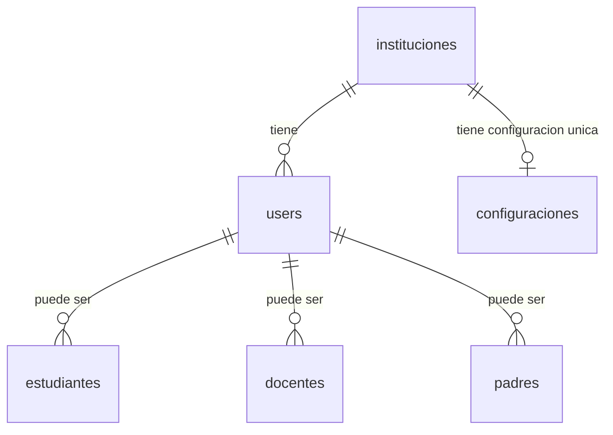

# 🏫 Sistema Multi-Institución

**Fecha de implementación:** 24 de diciembre de 2025  
**Versión:** 1.1.0

---

## 📋 Resumen de Cambios

El sistema ha sido actualizado para soportar **múltiples instituciones** en una sola base de datos, preparándolo para su comercialización como **SaaS** (Software as a Service).

---

## 🔄 Cambios en la Base de Datos

### 1. Tabla `users`
**Cambio:** Se agregó la columna `institucion_id`

```sql
ALTER TABLE users 
ADD COLUMN institucion_id BIGINT UNSIGNED NULL AFTER id,
ADD FOREIGN KEY (institucion_id) REFERENCES instituciones(id) ON DELETE SET NULL;
```

**Impacto:**
- ✅ Cada usuario ahora está afiliado a una institución específica
- ✅ Permite segregar usuarios por institución
- ✅ Los usuarios sin institución son administradores del sistema

### 2. Tabla `configuraciones`
**Cambios:** 
- Se agregó la columna `institucion_id` con constraint UNIQUE
- Se transformó de tabla clave-valor a tabla estructurada con todas las configuraciones

```sql
ALTER TABLE configuraciones 
ADD COLUMN institucion_id BIGINT UNSIGNED NOT NULL AFTER id,
ADD UNIQUE KEY unique_institucion_config (institucion_id),
ADD FOREIGN KEY (institucion_id) REFERENCES instituciones(id) ON DELETE CASCADE;
```

**Nueva estructura:**
- **Académico:** periodo_actual_id, número de quimestres/parciales, fechas de clases, porcentaje de asistencia
- **Calificaciones:** escalas, ponderaciones, permisos (supletorio, remedial, gracia), redondeo
- **Horarios:** duración de períodos, recreos, períodos por día, días laborales
- **Correo:** configuración SMTP completa (host, puerto, encriptación, credenciales)
- **Notificaciones:** flags para diferentes tipos de notificaciones, plantillas de correo

**Impacto:**
- ✅ Cada institución tiene su propia configuración única
- ✅ Configuraciones independientes para cada cliente
- ✅ No hay conflictos entre instituciones
- ✅ Fácil personalización por institución

---

## 📊 Diagrama de Relaciones Actualizado



**Relaciones clave:**
- Una institución tiene **muchos usuarios** (1:N)
- Una institución tiene **una configuración** (1:1)
- Un usuario pertenece a **una institución** (N:1)

---

## 🔧 Cambios en Modelos

### Modelo `User`
```php
class User extends Authenticatable
{
    protected $fillable = [
        'institucion_id', // ✅ NUEVO
        'name',
        'email',
        // ... otros campos
    ];

    // ✅ NUEVA RELACIÓN
    public function institucion(): BelongsTo
    {
        return $this->belongsTo(Institucion::class);
    }
}
```

### Modelo `Configuracion`
```php
class Configuracion extends Model
{
    protected $fillable = [
        'institucion_id', // ✅ NUEVO
        'periodo_actual_id',
        'numero_quimestres',
        'numero_parciales',
        // ... todos los campos de configuración
    ];

    // ✅ NUEVA RELACIÓN
    public function institucion(): BelongsTo
    {
        return $this->belongsTo(Institucion::class);
    }

    public function periodoActual(): BelongsTo
    {
        return $this->belongsTo(PeriodoAcademico::class, 'periodo_actual_id');
    }
}
```

### Modelo `Institucion`
```php
class Institucion extends Model
{
    // ✅ RELACIONES ACTUALIZADAS
    public function users(): HasMany
    {
        return $this->hasMany(User::class);
    }

    public function configuracion(): HasOne
    {
        return $this->hasOne(Configuracion::class);
    }
}
```

---

## 🌱 Seeders Actualizados

### DatabaseSeeder
**Orden corregido:**
```php
$this->call([
    InstitucionSeeder::class,        // 1️⃣ Primero instituciones
    RoleSeeder::class,                // 2️⃣ Luego roles y usuarios
    EstructuraAcademicaSeeder::class, // 3️⃣ Luego períodos académicos
    ConfiguracionSeeder::class,       // 4️⃣ Finalmente configuraciones
    // ... resto de seeders
]);
```

### ConfiguracionSeeder
**Actualizado para crear configuración por cada institución:**
```php
public function run(): void
{
    $periodo = PeriodoAcademico::first();
    $instituciones = Institucion::all();
    
    foreach ($instituciones as $institucion) {
        Configuracion::updateOrCreate(
            ['institucion_id' => $institucion->id],
            [
                'periodo_actual_id' => $periodo->id,
                // ... todos los campos con valores por defecto
            ]
        );
    }
}
```

---

## 🎯 Beneficios del Sistema Multi-Institución

### Para el Negocio
1. **Modelo SaaS:** Una instalación sirve a múltiples clientes
2. **Escalabilidad:** Agregar nuevas instituciones sin modificar código
3. **Mantenimiento centralizado:** Una actualización beneficia a todos
4. **Costos reducidos:** Infraestructura compartida
5. **Demo fácil:** Crear instituciones de prueba rápidamente

### Para las Instituciones
1. **Aislamiento de datos:** Cada institución tiene su propia configuración
2. **Personalización:** Configuraciones adaptadas a sus necesidades
3. **Independencia:** Cambios en una institución no afectan a otras
4. **Seguridad:** Usuarios segregados por institución

---

## 📝 Cómo Agregar Nuevas Instituciones

### Opción 1: Programáticamente
```php
use App\Models\Institucion;
use App\Models\Configuracion;
use App\Models\PeriodoAcademico;

// Crear institución
$institucion = Institucion::create([
    'nombre' => 'Colegio San Francisco',
    'codigo_amie' => '09H00123',
    'tipo' => 'fiscal',
    'nivel' => 'Educación General Básica y Bachillerato',
    'jornada' => 'Matutina',
    'provincia' => 'Guayas',
    'ciudad' => 'Guayaquil',
    'canton' => 'Guayaquil',
    'parroquia' => 'Urdesa',
    'direccion' => 'Av. Principal 123',
    'telefono' => '04-2345678',
    'email' => 'info@colegiosanfrancisco.edu.ec',
    'rector' => 'Dr. Juan Pérez',
]);

// Crear su configuración
$periodo = PeriodoAcademico::where('estado', 'activo')->first();
$configuracion = Configuracion::create([
    'institucion_id' => $institucion->id,
    'periodo_actual_id' => $periodo->id,
    'numero_quimestres' => 2,
    'numero_parciales' => 3,
    'calificacion_minima' => 0,
    'calificacion_maxima' => 10,
    'nota_minima_aprobacion' => 7,
    // ... otros campos con valores por defecto
]);
```

### Opción 2: Mediante Seeder
```bash
# Agregar institución en InstitucionSeeder.php
# Ejecutar:
php artisan db:seed --class=InstitucionSeeder
php artisan db:seed --class=ConfiguracionSeeder
```

### Opción 3: Interfaz Web (Futuro)
- Panel de administración del sistema
- Formulario de registro de nuevas instituciones
- Auto-creación de configuración por defecto

---

## 🔐 Consideraciones de Seguridad

### Middleware recomendado
Crear middleware para filtrar datos por institución:

```php
// app/Http/Middleware/FilterByInstitucion.php
class FilterByInstitucion
{
    public function handle($request, Closure $next)
    {
        $user = auth()->user();
        
        if ($user && $user->institucion_id) {
            // Aplicar scope global a todos los modelos
            // para filtrar por institución automáticamente
        }
        
        return $next($request);
    }
}
```

### Políticas de autorización
```php
// Verificar que el usuario solo acceda a datos de su institución
public function view(User $user, Estudiante $estudiante)
{
    return $user->institucion_id === $estudiante->user->institucion_id;
}
```

---

## 📚 Documentación Actualizada

Los siguientes documentos han sido actualizados para reflejar estos cambios:

- ✅ [4 - Diagrama DB.md](4%20-%20Diagrama%20DB.md)
  - Diagrama ER actualizado
  - Descripción de tablas users y configuraciones
  - Relaciones actualizadas

- ✅ [6 - Avances.md](6%20-%20Avances.md)
  - Sección "Sistema Multi-Institución Implementado"
  - Detalles de implementación por tabla
  - Beneficios documentados

- ✅ [7 - Mockups.md](7%20-%20Mockups.md)
  - Vista de configuraciones actualizada
  - Descripción de campos completos
  - Relaciones con instituciones

---

## 🚀 Próximos Pasos Sugeridos

### Corto Plazo
1. **Panel de administración del sistema**
   - Vista para crear/editar instituciones
   - Asignación de usuarios a instituciones
   - Monitoreo de uso por institución

2. **Filtros automáticos**
   - Implementar middleware de filtrado
   - Aplicar scopes globales
   - Proteger rutas por institución

3. **Testing**
   - Tests de segregación de datos
   - Tests de políticas de autorización
   - Tests de creación de instituciones

### Mediano Plazo
1. **Multi-tenancy avanzado**
   - Subdominios por institución (`institucion.sistema.com`)
   - Temas personalizables por institución
   - Logos y colores propios

2. **Facturación y suscripciones**
   - Planes por institución
   - Límites de usuarios
   - Módulos activables/desactivables

3. **Analytics**
   - Dashboard de uso por institución
   - Reportes de actividad
   - Métricas de rendimiento

---

## 📞 Contacto y Soporte

Para preguntas o soporte relacionado con el sistema multi-institución:
- **Documentación:** Ver carpeta `docs/`
- **Código fuente:** Revisar modelos y migraciones
- **Ejemplos:** Ver seeders para casos de uso

---

**Versión del sistema:** 1.1.0  
**Última actualización:** 24 de diciembre de 2025  
**Estado:** ✅ Implementado y funcional
